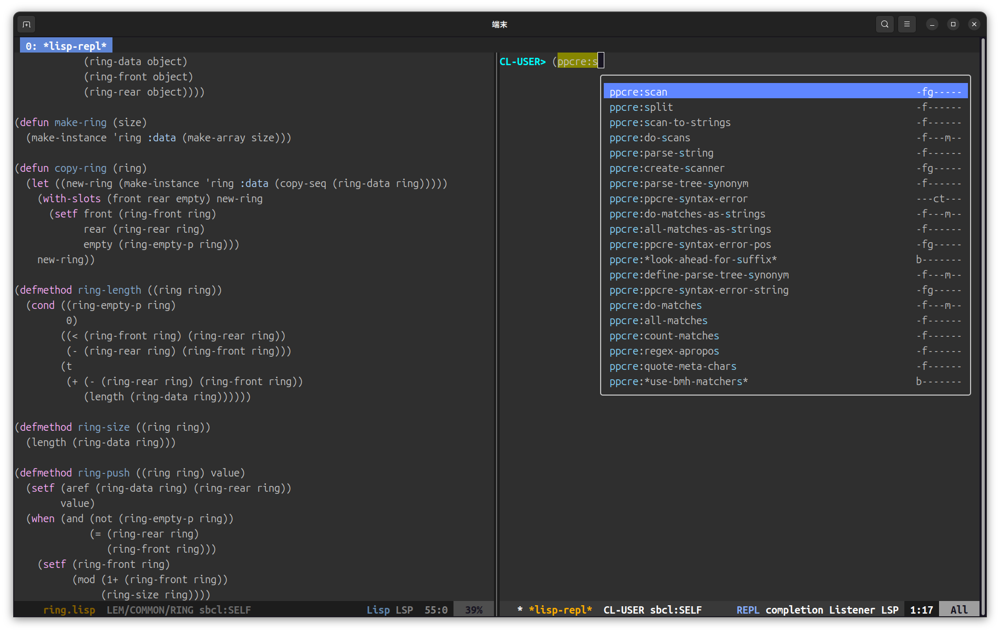
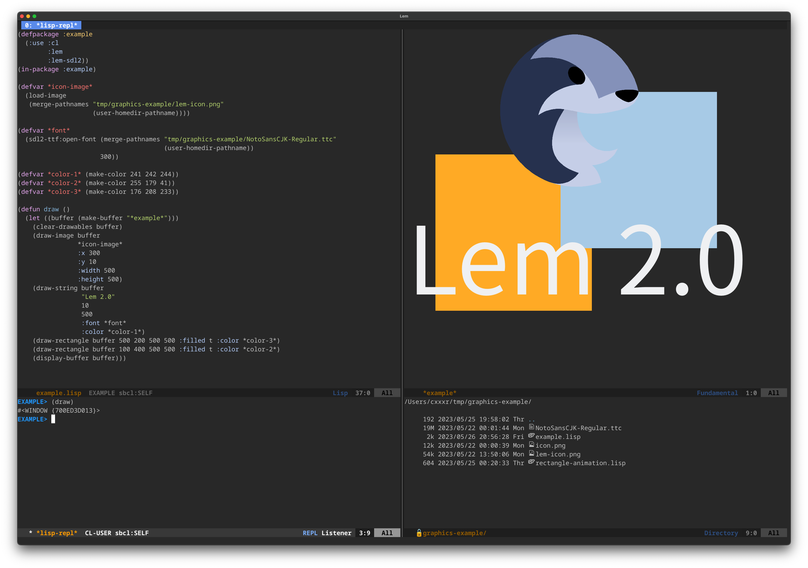

# Lem is the editor/IDE well-tuned for Common Lisp.

 

After installing lem, you can start developing in Common Lisp at once.

You can skip over writing tidy settings or installing many plugins as you do on Emacs.

Lem supports other programming languages thanks to its built-in LSP
client. You can choose between an Emacs and a Vim mode.

Other Lem features include:

- a **project explorer** tree view
- project-aware commands
- interactive **grep** and **git** interfaces
- **multiple cursors**
- tetris
- and more…

## Install

With Docker (ncurses version):

    $ docker run --rm -it ghcr.io/lem-project/lem:latest

### Lem-ncurses
- [GNU/Linux](https://lem-project.github.io/installation/ncurses/linux/)
- [MacOS](https://lem-project.github.io/installation/ncurses/macos/)
- [Windows](https://lem-project.github.io/installation/ncurses/windows/)

### Lem-sdl2
- [GNU/Linux](https://lem-project.github.io//installation/sdl2/linux/)
- [MacOS](https://lem-project.github.io//installation/sdl2/macos/)
- [Windows](https://lem-project.github.io//installation/sdl2/windows/)

## Screenshots
　　

　　

## Contributors

This project exists thanks to all the people who contribute. [[Contribute]](CONTRIBUTING.md).

## Backers

Thank you to all our backers! 🙏 [[Become a backer](https://opencollective.com/lem#backer)]

## Sponsors

Support this project by becoming a sponsor. Your logo will show up here with a link to your website. [[Become a sponsor](https://opencollective.com/lem#sponsor)]

# License
[MIT](https://github.com/lem-project/lem/blob/master/LICENCE)
