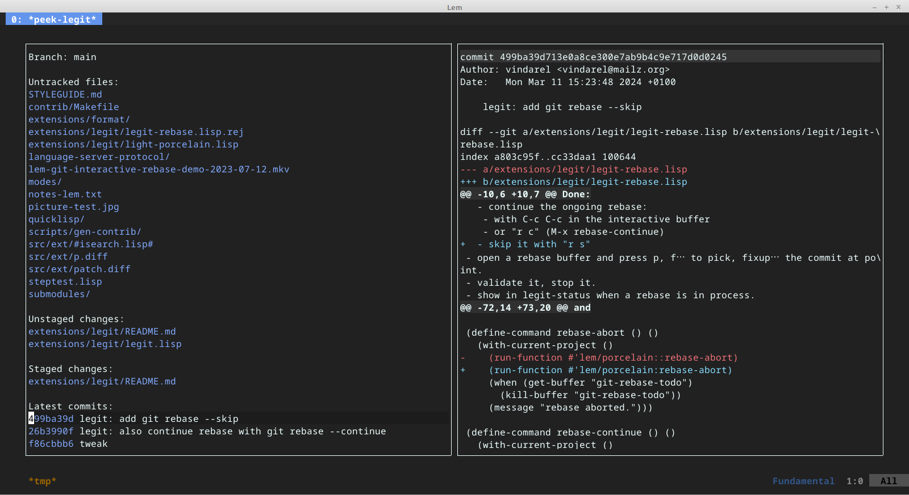

# Lem/legit

`legit` is an interactive version control system interface for Lem. Its main focus is to
support Git operations, but it also has preliminary support for other
VCSs (Fossil, Mercurial).

We can currently open a **status** window, **stage** and unstage files or diff hunks, **commit** our changes or again start an **interactive rebase**.

Its main source of inspiration is, obviously, Magit.

## Status

`legit` is in development. It isn't finished nor complete nor at
feature parity with Magit nor suitable for mission-critical work. Use
at your own risk.

However it should run a few operations smoothly.

## M-x legit-status

Bound to `C-x g` by default.

The status windows show us, on the left:

- the current branch (or "trunk")
- the untracked files.
- the unstaged changes, staged changes,
- the latest commits.

It also warns us if a rebase is in process.

and the window on the right shows us the file diffs or the commits' content.

Refresh the status content with `g`.



## Help

Press `?` or `C-x ?` to call `legit-help`.

## Navigation

We can navigate inside legit windows with `n`, `p`, `M-n` and `M-p` (go to next/previous section).

To change windows, use the usual `M-o` key from Lem.

Quit with `q` or `C-x 0` (zero).

## Stage or unstage files, diff hunks (s, u)

Stage changes with "s".

When your cursor is on an `Unstaged change` file, you can see the file
changes on the right, and you can stage the whole file with `s`.

You can also go to the diff window on the right, navigate the diff hunks with `n` and `p` and stage a hunk with `s`.

Unstage a change with `u`.

## Discard changes to a file

Use `k`. Be careful, you can loose your changes.

## Commit

Pressing `c` opens a new buffer where you can write your commit message.

Validate with `C-c C-c` and quit with `M-q` (or `C-c C-k`).

## Branches, push, pull

Checkout a branch with `b b` ("b" followed by another "b").

Create a new branch with `b c`.

You can push to the current remote branch with `P p` and pull changes (fetch) with `F p`.

Note: after pressing "P" or "F", you will not see an intermediate window giving you choices. Just press "P p" one after the other.

## Show commits log

Press `l l` (lowercase "L", twice) to show the commits log in a dedicated buffer, with pagination.

It defaults to showing the first 200 commits. Press `f` or `b` to see
the next or the previous page of the commits history.

Press `F` and `B` to go to the last or first page of commits.

Configuration:

- you can set `lem/porcelain:*commits-log-page-size*` to another length (defaults to 200).

Note that going to the last page with `B` might take a few seconds on large repositories.


## Interactive rebase

You can start a Git interactive rebase. Place the cursor on a commit you want to rebase from, and press `r i`.

You will be dropped into the classical Git rebase file, that presents you commits and an action to apply on them: `pick` the commit, `drop` it, `fixup`, edit, reword, squash…

For example:

```
pick 26b3990f the following commit
pick 499ba39d some commit

# Commands:
# p, pick <commit> = use commit
# r, reword <commit> = use commit, but edit the commit message
# e, edit <commit> = use commit, but stop for amending
# s, squash <commit> = use commit, but meld into previous commit
# f, fixup <commit> = like "squash", but discard this commit's log message
# x, exec <command> = run command (the rest of the line) using shell
# b, break = stop here (continue rebase later with 'git rebase --continue')
# d, drop <commit> = remove commit
# l, label <label> = label current HEAD with a name
# t, reset <label> = reset HEAD to a label
# m, merge [-C <commit> | -c <commit>] <label> [# <oneline>]
# .       create a merge commit using the original merge commit's
# .       message (or the oneline, if no original merge commit was
# .       specified). Use -c <commit> to reword the commit message.
#
# These lines can be re-ordered; they are executed from top to bottom.
#
# If you remove a line here THAT COMMIT WILL BE LOST.
#
# However, if you remove everything, the rebase will be aborted.
#
# Note that empty commits are commented out
```

`legit` binds keys to the rebase actions:

- use `p` to "pick" the commit (the default)
- `f` to fixup

and so on.

Validate anytime with `C-c C-c` and abort with `C-c C-k`.

NOTE: at the time of writing, "reword" and "edit" are not supported.

NOTE: the interactive rebase is currently Unix only. This is due to the short shell script we use to control the Git process. Come join us if you know how to "trap some-fn SIGTERM" for Windows plateforms.

### Abort, continue, skip

In any `legit` window, type `r a` to abort a rebase process (if it was
started by you inside Lem or by another process), `r c` to call `git rebase --continue` and `r s` to call `git rebase --skip`.


## Fossil

We have basic Fossil support: see current branch, add change, commit.

## Mercurial

We have basic Mercurial support.

## Customization

In the `lem/porcelain` package:

```lisp
(defvar *git-base-arglist* (list "git")
  "The git program, to be appended command-line options.")
```

=> you can change the default call to the git binary.

Same with `*fossil-base-args*` and `*hg-base-arglist*`.

- `*nb-latest-commits*`: defaults to 10
- `*branch-sort-by*`: when listing branches, sort by this field name. Prefix with "-" to sort in descending order. Defaults to "-creatordate", to list the latest used branches first.
- `*file-diff-args*`: defaults to `(list "diff" "--no-color")`. Arguments to display the file diffs. Will be surrounded by the git binary and the file path. For staged files, --cached is added by the command.

If a project is managed by more than one VCS, `legit` takes the first VCS defined in `lem/legit:*vcs-existence-order*`. You can change it like so:

~~~lisp
(setf lem/legit:*vcs-existence-order* '(:git :fossil :hg))
~~~

You could also use a function to decide of your own order. It would
take no arguments and it must return one value: an instance of the VCS
object, such as `lem/porcelain/git::vcs-git`, if the current project is considered a
Git/Fossil/Mercurial project, and nil otherwise.

Variables and parameters for customization are defined in the `lem/legit` package. They might not be exported.

see sources in `/extensions/legit/`


## Implementation details

Repository data is retrieved with calls to the VCS binary, but currently only 2 or 3 calls are made for a legit status window, so it works fine with big repositories. We have a POC to read some data directly from the Git objects (and improve efficiency).

The interactive rebase currently uses a Unix-only shell script.

## Reporting bugs

Please report any bug, and please let's discuss before you open a Github issue for a feature request. We know there is so much to do. We can do so on [Github Discussions](https://github.com/lem-project/lem/discussions) and [on Discord](https://discord.gg/NHzqbw4zVR).


## TODOs

- interactive rebase: support reword, edit.
- show renamed files

and then:

- visual submenu to pick subcommands
- stage only selected region (more precise than hunks)
- unstage/stage/discard multiple files
- stashes
- many, many more commands, settings and switches
- mouse context menus
