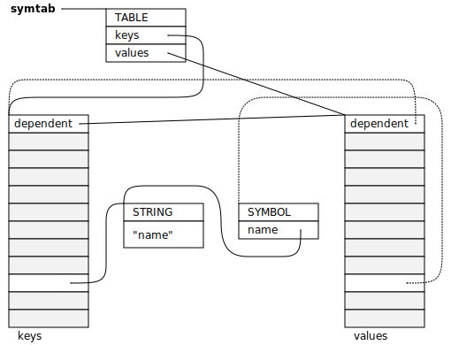

.. _guide-advanced:

Advanced topics
===============

.. index::
   single: finalization; example
   single: Scheme; finalization
   single: Scheme; ports

Finalization
------------

In Scheme, an open file is represented by a *port*. In the toy Scheme
interpreter, a port is a wrapper around a standard C file handle::

    typedef struct port_s {
        type_t type;                    /* TYPE_PORT */
        obj_t name;                     /* name of stream */
        FILE *stream;
    } port_s;

Operating systems limit the number of files that a process can have open
simultaneously, so to avoid running out of file handles, it is necessary
to close ports when you are done with them. If a Scheme program fails to
call ``close-input-file``, then the underlying file handle should still
be closed when the port object :term:`dies <dead>`. This procedure is
known as :term:`finalization`.

Any block in an :term:`automatically managed <automatic memory
management>` :term:`pool` can be registered for finalization by calling
:c:func:`mps_finalize`. In the toy Scheme interpreter, this can be done
in ``make_port``:

.. code-block:: c
   :emphasize-lines: 18

    static obj_t make_port(obj_t name, FILE *stream)
    {
        mps_addr_t port_ref;
        obj_t obj;
        mps_addr_t addr;
        size_t size = ALIGN_OBJ(sizeof(port_s));
        do {
            mps_res_t res = mps_reserve(&addr, obj_ap, size);
            if (res != MPS_RES_OK) error("out of memory in make_port");
            obj = addr;
            obj->port.type = TYPE_PORT;
            obj->port.name = name;
            obj->port.stream = stream;
        } while(!mps_commit(obj_ap, addr, size));
        total += sizeof(port_s);

        port_ref = obj;
        mps_finalize(arena, &port_ref);

        return obj;
    }

The MPS implements finalization by posting a :term:`message` to the
arena's :term:`message queue` when an object that has been registered
for finalization is about to die.

If you want to finalize your objects, you must first enable
finalization messages by calling :c:func:`mps_message_type_enable`::

    mps_message_type_enable(arena, mps_message_type_finalization());

You must then poll the arena's message queue at times that are
convenient for you, call :c:func:`mps_message_get` to pick up a
finalization message from the queue, call
:c:func:`mps_message_finalization_ref` to access the finalized object,
and finally call :c:func:`mps_message_discard` on the finalization
message. The finalized object is then subject to the normal rules of
life and death: it continues to live as long as it is strongly
reachable.

In the toy Scheme interpreter, the most convenient moment to process the
message queue is at the start of the read–eval–print loop. When a
finalization message is found, the associated file handle is closed
(unless it has been closed already), and the message is discarded.

.. code-block:: c
   :emphasize-lines: 9, 12, 25

    mps_message_type_t type;

    while (mps_message_queue_type(&type, arena)) {
        mps_message_t message;
        mps_bool_t b;
        b = mps_message_get(&message, arena, type);
        assert(b); /* we just checked there was one */

        if (type == mps_message_type_finalization()) {
            mps_addr_t port_ref;
            obj_t port;
            mps_message_finalization_ref(&port_ref, arena, message);
            port = port_ref;
            assert(TYPE(port) == TYPE_PORT);
            if(port->port.stream) {
                printf("Port to file \"%s\" is dying. Closing file.\n",
                       port->port.name->string.string);
                (void)fclose(port->port.stream);
                port->port.stream = NULL;
            }
        } else {
            /* ... handle other message types ... */
        }

        mps_message_discard(arena, message);
    }

Here's an example session showing finalization taking place:

.. code-block:: none
   :emphasize-lines: 8

    MPS Toy Scheme Example
    9960, 0> (open-input-file "scheme.c")
    #[port "scheme.c"]
    10064, 0> (gc)
    Collection started.
      Why: Client requests: immediate full collection.
      Clock: 3401
    Port to file "scheme.c" is dying. Closing file.
    Collection finished.
        live 10040
        condemned 10088
        not_condemned 0
        clock: 3807

It's wise not to depend on finalization as the only method for
releasing resources (see the :ref:`topic-finalization-cautions`
section in :ref:`topic-finalization`), because the garbage collector
does not promise to collect particular objects at particular times,
and in any case it does so only when it can prove that the object is
:term:`dead`. So it is best to provide a reliable mechanism for
releasing the resource (here, the Scheme function
``close-input-port``), and use finalization as a backup strategy.

But this raises the possibility that a port will be closed twice: once
via ``close-input-port`` and a second time via finalization. So it's
necessary to make ports robust against being closed multiple times.
The toy Scheme interpreter does so by setting ``stream`` to ``NULL``:
this ensures that the file handle won't be closed more than once.

.. code-block:: c
    :emphasize-lines: 6

    static void port_close(obj_t port)
    {
        assert(TYPE(port) == TYPE_PORT);
        if(port->port.stream != NULL) {
            fclose(port->port.stream);
            port->port.stream = NULL;
        }
    }

Note that because finalization messages are processed synchronously
via the message queue (and the Scheme interpreter is single-threaded)
there is no need for a lock here.

It's still possible that the toy Scheme interpreter might run out of
open file handles despite having some or all of its port objects being
finalizable. That's because the arena's message queue is only polled
after evaluating an expression at top level: if the expression itself
opens too many file handles, the finalization messages will queue up and
not be processed in time. For example:

.. code-block:: none

    MPS Toy Scheme Example
    9960, 0> (define (repeat n f _) (if (eqv? n 0) '() (repeat (- n 1) f (f))))
    repeat
    10840, 0> (repeat 300 (lambda () (open-input-file "scheme.c")) 0)
    open-input-file: cannot open input file

A less naïve interpreter might process finalization messages on a more
regular schedule, or might take emergency action in the event of running
out of open file handles by carrying out a full garbage collection and
processing any finalization messages that are posted as a result.

.. topics::

    :ref:`topic-finalization`, :ref:`topic-message`.

.. index::
   single: location dependency; example
   single: hash table; address-based example 
   single: Scheme; address-based hash table
   single: Scheme; location dependency

.. _guide-advanced-location:

Location dependency
-------------------

The toy Scheme interpreter contains an address-based (``eq?``) hash
table implementation. It hashes the addresses of its keys, and so needs
to take account of the possibility that a :term:`moving garbage
collector` might move the keys. If it fails to take account of this, the
hash table might become invalid after a garbage collection.

In the interaction shown below (with a naïve version of the code) you'll
see that although the keys remain present in the table after garbage
collection, they cannot be found. This is because their locations (and
hence their hashes) have changed, but their positions in the table have
not been updated to match.

.. code-block:: none

    MPS Toy Scheme Example
    10240, 0> (define ht (make-eq-hashtable))
    ht
    10584, 0> (hashtable-set! ht 'one 1)
    10768, 0> (hashtable-set! ht 'two 2)
    10952, 0> (hashtable-set! ht 'three 3)
    11136, 0> ht
    #[hashtable (two 2) (three 3) (one 1)]
    11136, 0> (hashtable-ref ht 'two #f)
    2
    11280, 0> (gc)
    11304, 1> (hashtable-ref ht 'one #f)
    #f
    11448, 1> (hashtable-ref ht 'two #f)
    #f
    11592, 1> (hashtable-ref ht 'three #f)
    #f
    11736, 1> ht
    #[hashtable (two 2) (three 3) (one 1)]

The MPS solves this problem with its :dfn:`location dependency`
feature: a structure of type :c:type:`mps_ld_s` encapsulates a set of
dependencies on the locations of blocks. You add addresses to the
location dependency, and then later test an address to see if it is
:dfn:`stale`: that is, if the block at that address might have moved
since its location was depended upon.

You need to provide space for the :c:type:`mps_ld_s` structure. In the
case of a hash table, it is most convenient to inline it in the hash
table's metadata:

.. code-block:: c
    :emphasize-lines: 5

    typedef struct table_s {
      type_t type;                  /* TYPE_TABLE */
      hash_t hash;                  /* hash function */
      cmp_t cmp;                    /* comparison function */
      mps_ld_s ld;                  /* location dependency */
      obj_t buckets;                /* hash buckets */
    } table_s;

Before being used, the location dependency must be reset to indicate
that nothing is depended upon, by calling :c:func:`mps_ld_reset`.

For example:

.. code-block:: c
    :emphasize-lines: 19

    static obj_t make_table(size_t length, hash_t hashf, cmp_t cmpf)
    {
        obj_t obj;
        mps_addr_t addr;
        size_t l, size = ALIGN_OBJ(sizeof(table_s));
        do {
            mps_res_t res = mps_reserve(&addr, obj_ap, size);
            if (res != MPS_RES_OK) error("out of memory in make_table");
            obj = addr;
            obj->table.type = TYPE_TABLE;
            obj->table.buckets = NULL;
        } while(!mps_commit(obj_ap, addr, size));
        total += size;
        obj->table.hash = hashf;
        obj->table.cmp = cmpf;
        /* round up to next power of 2 */
        for(l = 1; l < length; l *= 2);
        obj->table.buckets = make_buckets(l);
        mps_ld_reset(&obj->table.ld, arena);
        return obj;
    }

*Before* the hash table becomes dependent on the location of a block,
the address of the block must be added to its location dependency by
calling :c:func:`mps_ld_add`. In particular, you must call
:c:func:`mps_ld_add` before computing the hash of the address. (If you
wait until afterwards, it might be too late: a garbage collection might
have taken place after the hash was computed but before you added the
dependency.)

In the toy Scheme interpreter, this is done just before the computation
of the hash of the address.

.. code-block:: c
    :emphasize-lines: 4

    static unsigned long eq_hash(obj_t obj, mps_ld_t ld)
    {
        union {char s[sizeof(obj_t)]; obj_t addr;} u;
        if (ld) mps_ld_add(ld, arena, obj);
        u.addr = obj;
        return hash(u.s, sizeof(obj_t));
    }

By adding the dependency at this point in the code, the implementation
avoids adding unnecessary dependencies on a location. For example, an
``eqv?`` hash table does not need to depend on the location of numbers
and characters::

    static unsigned long eqv_hash(obj_t obj, mps_ld_t ld)
    {
        switch(TYPE(obj)) {
            case TYPE_INTEGER:
                return obj->integer.integer;
            case TYPE_CHARACTER:
                return obj->character.c;
            default:
                return eq_hash(obj, ld);
        }
    }

and a ``string=?`` hash table does not need to depend on the location of
any of its keys.

.. note::

    The garbage collector may run at any time, so a key may become
    stale at any time after calling :c:func:`mps_ld_add`, perhaps even
    before you've added it!

    It's best to postpone worrying about this until this key is actually
    looked up, when the staleness will be discovered. After all, it may
    never be looked up.

If you look up a key in an address-based hash table and fail to find it
there, that might be because the table's dependency on the location of
the key is stale: that is, if the garbage collector moved the key. The
function :c:func:`mps_ld_isstale` tells you if a block whose
location you depended upon since the last call to
:c:func:`mps_ld_reset` might have moved.

In the toy Scheme interpreter this behaviour is encapsulated into ``table_find``:

.. code-block:: c
    :emphasize-lines: 7

    static struct bucket_s *table_find(obj_t tbl, obj_t key, int add)
    {
        struct bucket_s *b;
        assert(TYPE(tbl) == TYPE_TABLE);
        b = buckets_find(tbl, tbl->table.buckets, key, add);
        if ((b == NULL || b->key == NULL || b->key == obj_deleted)
            && mps_ld_isstale(&tbl->table.ld, arena, key))
        {
            b = table_rehash(tbl, tbl->table.buckets->buckets.length, key);
        }
        return b;
    }

It's important to test :c:func:`mps_ld_isstale` only in case of
failure. The function may report a false positive (returning true
despite the block not having moved). So if ``key`` has not moved, then
if you tested :c:func:`mps_ld_isstale` first, it might return true and
so you'd end up unnecessarily rehashing the whole table. (It's
crucial, however, to actually test that ``key`` appears in the table,
not just that some key with the same hash does.)

When a table is rehashed, call :c:func:`mps_ld_reset` to clear the
location dependency, and then :c:func:`mps_ld_add` for each key before it is added back to the table.

.. note::

    After :c:func:`mps_ld_isstale` has returned true, and after
    rehashing the table, I don't just repeat the usual lookup by calling
    ``buckets_find``. That's because the table might have become stale
    again already.

    Instead, ``table_rehash`` finds and returns the bucket containing
    ``key``. (Since it has to loop over all the entries in the table
    anyway, it might as well find this bucket too.)

By adding the line::

    puts("stale!");

in ``table_find`` after :c:func:`mps_ld_isstale` returns true, it's
possible to see when the location dependency becomes stale and the
table has to be rehashed:

.. code-block:: none
    :emphasize-lines: 21, 23

    MPS Toy Scheme Example
    10240, 0> (define ht (make-eq-hashtable))
    ht
    10584, 0> (hashtable-set! ht 'one 1)
    10768, 0> ht
    #[hashtable (one 1)]
    10768, 0> (gc)
    10792, 1> (hashtable-ref ht 'one #f)
    stale!
    1
    11080, 1> (hashtable-set! ht 'two 2)
    11264, 1> (gc)
    11288, 2> (hashtable-ref ht 'one #f)
    stale!
    1
    11576, 2> (hashtable-set! ht 'three 3)
    11760, 2> (hashtable-ref ht 'two #f)
    2
    11904, 2> (gc)
    11928, 3> (hashtable-ref ht 'one #f)
    1
    12072, 3> (hashtable-ref ht 'two #f)
    stale!
    2
    12360, 3> (hashtable-ref ht 'three #f)
    3

.. note::

    In case you're puzzled by the highlighted lines: the symbol
    ``'one`` must not have been moved by the collection, and so was
    found in the table at the correct location. Thus
    :c:func:`mps_ld_isstale` was not called. The symbol ``'two`` did
    move in the collection, so it's not found in the table, and that
    causes :c:func:`mps_ld_isstale` to be tested.

Don't forget to check the location dependency for staleness when
setting a value for key in a hash table, and when deleting a key from
a hash table. Here's an interaction with the toy Scheme interpreter
showing a key being found to be stale when setting and when deleting
it:

.. code-block:: none

    MPS Toy Scheme Example
    13248, 0> (define ht (make-eq-hashtable))
    ht
    13624, 0> (hashtable-set! ht 'a 1)
    13808, 0> (gc)
    13832, 1> (hashtable-set! ht 'a 2)
    stale!
    13832, 1> (hashtable-delete! ht 'one)
    stale!
    14152, 1> (gc)
    14176, 2> (hashtable-delete! ht 'a)
    stale!
    14456, 2> ht
    #[hashtable]

.. topics::

    :ref:`topic-location`.

.. index::
   single: weak reference; example
   single: hash table; weak example 
   single: Scheme; weak hash table

.. _guide-advanced-weak:

Weak hash tables
----------------

A :term:`weak-key hash table` has :term:`weak references (1)` to its
keys. If the key dies, the value corresponding to that key is
automatically deleted from the table too. Similarly, a
:term:`weak-value hash table` has weak references to its values, and a
:term:`doubly weak hash table` has weak references to both.

In this section, I'll describe how to add all three types of weak hash
table to the toy Scheme interpreter. This requires a few far-reaching
changes to the code, so in order to keep the basic integration
understandable by newcomers to the MPS, I've made these changes in a
separate version of the code:

:download:`scheme-advanced.c <../../../example/scheme/scheme-advanced.c>`

    The Scheme interpreter after a number of "advanced" features,
    including weak hash tables, have been implemented.

The MPS supports weak references only in :term:`roots` and in blocks
allocated in pools belonging to the :ref:`pool-awl` pool class. Roots
aren't convenient for this use case: it's necessary for hash tables
to be automatically reclaimed when they die. So AWL it is.

.. note::

    This isn't a design limitation of the MPS: it's just that up until
    now the only uses our customers have had for weak references are the
    ones supported by AWL. (In particular, AWL was designed around the
    requirements of weak hash tables in `Open Dylan
    <http://opendylan.org/>`_.) If you need more general handling of
    weak references, :ref:`contact us <contact>`.

All the references in a :term:`formatted object` belong to the same
:term:`rank`: that is, they are all :term:`exact <exact references>`,
:term:`weak <weak references (1)>`, or :term:`ambiguous references`. In
AWL, the rank of references is specified when creating an
:term:`allocation point`. This has consequences for the design of the
hash table data structure: in weak-key strong-value hash tables, the
keys need to be in one object and the values in another (and the same is
true in the strong-key weak-value case). So instead of having one vector
of buckets with alternate keys and values, hash tables must have two
vectors, one for the keys and the other for the values, to allow keys
and values to have different ranks.

These vectors will be allocated from an AWL pool with two allocation
points, one for strong references, and one for weak references::

    static mps_pool_t buckets_pool; /* pool for hash table buckets */
    static mps_ap_t strong_buckets_ap; /* allocation point for strong buckets */
    static mps_ap_t weak_buckets_ap; /* allocation point for weak buckets */

.. note::

    It's not necessary to allocate the strong buckets from the same pool
    as the weak buckets, but we'll see below that they have to be
    allocated in a *non-moving* pool such as AWL.

The MPS :dfn:`splats` a weak reference in a :term:`formatted object` by
replacing it with a null pointer when it is :term:`fixed` by the object
format's :term:`scan method`. So the scan method for the buckets is
going to have the following structure. (See below for the actual code.) ::

    static mps_res_t buckets_scan(mps_ss_t ss, mps_addr_t base, mps_addr_t limit)
    {
        MPS_SCAN_BEGIN(ss) {
            while (base < limit) {
                buckets_t buckets = base;
                size_t length = buckets->length;
                for (i = 0; i < length; ++i) {
                    mps_addr_t p = buckets->bucket[i];
                    if (MPS_FIX1(ss, p)) {
                        mps_res_t res = MPS_FIX2(ss, &p);
                        if (res != MPS_RES_OK) return res;
                        if (p == NULL) {
                            /* TODO: key/value was splatted: splat value/key too */
                        }
                        buckets->bucket[i] = p;
                    }
                }
                base = (char *)base +
                    ALIGN_OBJ(offsetof(buckets_s, bucket) +
                              length * sizeof(buckets->bucket[0]));
            }
        } MPS_SCAN_END(ss);
        return MPS_RES_OK;
    }

But how can the corresponding key/value be splatted? A format method is
not normally allowed to access memory managed by the MPS in pools that
might protect their objects (see the :ref:`topic-format-cautions`
section in :ref:`topic-format`). The AWL pool class relaxes this
constraint by allowing each object in the pool to have a
:term:`dependent object`. When :term:`scanning <scan>` an object in an
AWL pool, the MPS ensures that the dependent object is not protected.
The dependent object does not have to be in the same pool as the
original object, but must be in a non-moving pool. See
:ref:`pool-awl-dependent`.

So the value buckets will be the dependent object of the key buckets,
and vice versa.

The AWL pool determines an object's dependent object by calling a
function that you supply when creating the pool. This means that each
object needs to have a reference to its dependent object::

    static mps_addr_t buckets_find_dependent(mps_addr_t addr)
    {
        buckets_t buckets = addr;
        return buckets->dependent;
    }

There's one final requirement to take into account before revealing the
new buckets structure, which is that each word in an object in an AWL
pool must either be a valid word-aligned reference, or else the bottom
bits of the word must be non-zero so that it does not look like an
aligned pointer. So the sizes stored in the buckets structure (the
length of the array of buckets, and the counts of used and deleted
buckets) must be tagged so that they cannot be mistaken for pointers.
See the :ref:`pool-awl-caution` section in :ref:`pool-awl`.

A one-bit tag suffices here::

    #define TAG_COUNT(i) (((i) << 1) + 1)
    #define UNTAG_COUNT(i) ((i) >> 1)

    typedef struct buckets_s {
        struct buckets_s *dependent;  /* the dependent object */
        size_t length;                /* number of buckets (tagged) */
        size_t used;                  /* number of buckets in use (tagged) */
        size_t deleted;               /* number of deleted buckets (tagged) */
        obj_t bucket[1];              /* hash buckets */
    } buckets_s, *buckets_t;

Now the full details of the scan method can be given, with the revised
code highlighted:

.. code-block:: c
    :emphasize-lines: 6-9, 16-22

    static mps_res_t buckets_scan(mps_ss_t ss, mps_addr_t base, mps_addr_t limit)
    {
        MPS_SCAN_BEGIN(ss) {
            while (base < limit) {
                buckets_t buckets = base; /* see note 1 */
                size_t i, length = UNTAG_COUNT(buckets->length);
                FIX(buckets->dependent);
                if(buckets->dependent != NULL)
                    assert(buckets->dependent->length == buckets->length);
                for (i = 0; i < length; ++i) {
                    mps_addr_t p = buckets->bucket[i];
                    if (MPS_FIX1(ss, p)) {
                        mps_res_t res = MPS_FIX2(ss, &p);
                        if (res != MPS_RES_OK) return res;
                        if (p == NULL) {
                            /* key/value was splatted: splat value/key too */
                            p = obj_deleted; /* see note 3 */
                            buckets->deleted = TAG_COUNT(UNTAG_COUNT(buckets->deleted) + 1);
                            if (buckets->dependent != NULL) { /* see note 2 */
                                buckets->dependent->bucket[i] = p;
                                buckets->dependent->deleted
                                    = TAG_COUNT(UNTAG_COUNT(buckets->dependent->deleted) + 1);
                            }
                        }
                        buckets->bucket[i] = p;
                    }
                }
                base = (char *)base + ALIGN_OBJ(offsetof(buckets_s, bucket) +
                                                length * sizeof(buckets->bucket[0]));
            }
        } MPS_SCAN_END(ss);
        return MPS_RES_OK;
    }

.. note::

    1. There's no need to dispatch on the type of the buckets object (or
       even to store a type at all) because buckets are the only objects
       to be stored in this pool.

    2. The dependent object must be :term:`fixed`, and because the
       reference to it might be weak, it might be splatted. This means
       that even if you are confident that you will always initialize
       this field, you still have to guard access to it, as here.

    3. This hash table implementation uses ``NULL`` to mean "never
       used" and ``obj_deleted`` to mean "formerly used but then
       deleted". So when a key is splatted it is necessary to replace
       it with ``obj_deleted``.

The :term:`skip method` is straightforward::

    static mps_addr_t buckets_skip(mps_addr_t base)
    {
        buckets_t buckets = base;
        size_t length = UNTAG_SIZE(buckets->length);
        return (char *)base + ALIGN_OBJ(offsetof(buckets_s, bucket) +
                                        length * sizeof(buckets->bucket[0]));
    }

Now we can create the object format, the pool and the allocation
points::

    /* Create the buckets format. */
    MPS_ARGS_BEGIN(args) {
        MPS_ARGS_ADD(args, MPS_KEY_FMT_ALIGN, ALIGNMENT);
        MPS_ARGS_ADD(args, MPS_KEY_FMT_SCAN, buckets_scan);
        MPS_ARGS_ADD(args, MPS_KEY_FMT_SKIP, buckets_skip);
        res = mps_fmt_create_k(&buckets_fmt, arena, args);
    } MPS_ARGS_END(args);
    if (res != MPS_RES_OK) error("Couldn't create buckets format");

    /* Create an Automatic Weak Linked (AWL) pool to manage the hash table
       buckets. */
    MPS_ARGS_BEGIN(args) {
        MPS_ARGS_ADD(args, MPS_KEY_FORMAT, buckets_fmt);
        MPS_ARGS_ADD(args, MPS_KEY_AWL_FIND_DEPENDENT, buckets_find_dependent);
        res = mps_pool_create_k(&buckets_pool, arena, mps_class_awl(), args);
    } MPS_ARGS_END(args);
    if (res != MPS_RES_OK) error("Couldn't create buckets pool");

    /* Create allocation points for weak and strong buckets. */
    MPS_ARGS_BEGIN(args) {
        MPS_ARGS_ADD(args, MPS_KEY_RANK, mps_rank_exact());
        res = mps_ap_create_k(&strong_buckets_ap, buckets_pool, args);
    } MPS_ARGS_END(args);
    if (res != MPS_RES_OK) error("Couldn't create strong buckets allocation point");
    MPS_ARGS_BEGIN(args) {
        MPS_ARGS_ADD(args, MPS_KEY_RANK, mps_rank_weak());
        res = mps_ap_create_k(&weak_buckets_ap, buckets_pool, args);
    } MPS_ARGS_END(args);
    if (res != MPS_RES_OK) error("Couldn't create weak buckets allocation point");

By adding the line::

    puts("splat!");

at the point in ``buckets_scan`` where the splatting of a weak reference
is detected, we can see this happening:

.. code-block:: none

    MPS Toy Scheme Example
    24624, 0> (define ht (make-doubly-weak-hashtable string-hash string=?))
    ht
    25264, 0> (hashtable-set! ht "one" 1)
    25456, 0> (hashtable-set! ht "two" 2)
    25648, 0> (hashtable-set! ht "three" 3)
    25840, 0> ht
    #[hashtable ("two" 2) ("one" 1) ("three" 3)]
    25864, 0> (gc)
    splat!
    splat!
    splat!
    25912, 1> ht
    #[hashtable]

.. topics::

    :ref:`topic-weak`, :ref:`pool-awl`.

.. index::
   single: Scheme; global symbol table

Global symbol table
-------------------

In the original (non-MPS) version of the toy Scheme interpreter, the
global symbol table was implemented as a key-only hash table, and each
symbol stored its own name.

But now that we have weak hash tables, it makes sense to re-implement
the global symbol table as a strong-key weak-value hash table mapping
strings to symbols. Each symbol will now contain a reference to its name
as a string object, instead of containing the name itself.

    Global symbol table design (weak references shown as dashed lines).

This design depends on the string object containing the symbol name
being immutable. As it happens, all strings are immutable, because the
toy Scheme interpreter doesn't implement ``string-set!``, but if it did
then some care would need to be taken. (Either by marking these strings
as immutable in some way, or by ensuring that these strings are
"private": that is, that Scheme programs never get hold of references to
them.)

When there are no more strong references to a symbol:

#. the reference to the symbol from the "values" array may be splatted;
#. that's detected by the buckets scan method, which deletes the
   corresponding entry in the "keys" array;
#. which may in turn cause the symbol name to die, unless there are
   other strong references keeping it alive.

Here's the new symbol structure::

    typedef struct symbol_s {
        type_t type;                  /* TYPE_SYMBOL */
        obj_t name;                   /* its name (a string) */
    } symbol_s;

and the new implementation of ``intern``::

    static obj_t intern_string(obj_t name)
    {
        obj_t symbol;
        assert(TYPE(name) == TYPE_STRING);
        symbol = table_ref(symtab, name);
        if(symbol == NULL) {
            symbol = make_symbol(name);
            table_set(symtab, name, symbol);
        }
        return symbol;
    }

    static obj_t intern(char *string)
    {
        return intern_string(make_string(strlen(string), string));
    }

The symbol table now becomes a very simple :term:`root`, that only has
to be registered once (not :ref:`every time it is rehashed
<guide-lang-root>`, as previously)::

    mps_addr_t ref;
    symtab = NULL;
    ref = &symtab;
    res = mps_root_create_table(&symtab_root, arena, mps_rank_exact(), 0,
                                ref, 1);
    if(res != MPS_RES_OK) error("Couldn't register symtab root");
    symtab = make_table(16, string_hash, string_equalp, 0, 1);

.. note::

     The order of operations is important here. The global variable
     ``symtab`` must be registered as a root before creating the symbol
     table, otherwise the symbol table might be collected in the
     interval between creation and registration. But we must also ensure
     that ``symtab`` is valid (that is, scannable) before registering it
     (in this case, by setting it to ``NULL``).

By printing ``splat!`` when the splatting of a weak reference is
detected by the scan method, we can see when symbols are dying:

.. code-block:: none

    MPS Toy Scheme Example
    24624, 0> (define a 1)
    a
    24832, 0> '(a b c d)
    (a b c d)
    25144, 0> (gc)
    splat!
    splat!
    splat!

Here, the symbols ``b``, ``c`` and ``d`` died, but ``a`` was kept alive
by the reference from the environment.

.. index::
   single: Scheme; segregation

.. _guide-advanced-segregation:

Segregation of objects
----------------------

When objects of different types have different properties (different
sizes, lifetimes, references, layouts) it makes sense to segregate
them into pools of appropriate classes. The garbage collector in the
MPS is designed to work efficiently with many pools: it traces
references between objects in different pools, and it coordinates the
scanning of the :term:`registers` and :term:`control stacks` (see
:ref:`topic-root-thread`).

For example, the toy Scheme interpreter has a mixture of object types,
some of which contain references to other objects (for example, pairs)
that must be :term:`scanned <scan>`, and some of which do not (for
example, strings). If the :term:`leaf objects` are segregated into a
pool of an appropriate class, the cost of scanning them can be
avoided.

Here the appropriate class is :ref:`pool-amcz`, and the necessary code
changes are straightforward. First, global variables for the new pool
and its :term:`allocation point`::

    static mps_pool_t leaf_pool;    /* pool for leaf objects */
    static mps_ap_t leaf_ap;        /* allocation point for leaf objects */

Second, the leaf objects must be allocated on ``leaf_ap`` instead of
``obj_ap``. And third, the pool and its allocation point must be created::

    /* Create an Automatic Mostly-Copying Zero-rank (AMCZ) pool to
       manage the leaf objects. */
    MPS_ARGS_BEGIN(args) {
        MPS_ARGS_ADD(args, MPS_KEY_CHAIN, obj_chain);
        MPS_ARGS_ADD(args, MPS_KEY_FORMAT, obj_fmt);
        res = mps_pool_create_k(&leaf_pool, arena, mps_class_amcz(), args);
    } MPS_ARGS_END(args);
    if (res != MPS_RES_OK) error("Couldn't create leaf pool");

    /* Create allocation point for leaf objects. */
    res = mps_ap_create_k(&leaf_ap, leaf_pool, mps_args_none);
    if (res != MPS_RES_OK) error("Couldn't create leaf objects allocation point");

Note that the new pool shared a :term:`generation chain` with the old
pool. This is important, because the leaf objects live and die along
with the non-leaf objects of similar ages.

As an initial step in making this change, the new pool uses the same
:term:`object format`. However, we normally wouldn't stop there: we'd
take advantage of the segregation to simplify the scanning of the
objects that have been left behind.

.. topics::

    :ref:`pool-amcz`.

