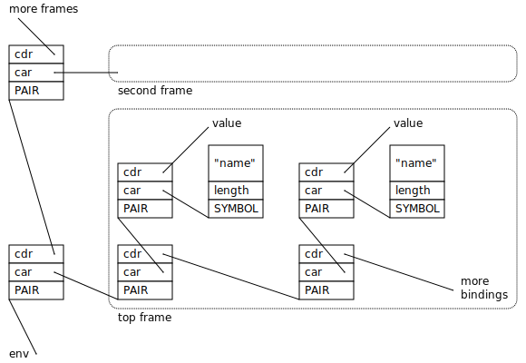

.. highlight:: none

.. index::
   single: debugging

.. _guide-debug:

Debugging with the Memory Pool System
=====================================

Memory management errors are some of the most stubborn and difficult
to track down, because the effect so often appears at a distant point
in the program that is seemingly unrelated to the cause, and by the
time the error is revealed, the information needed to reconstruct the
cause has long vanished. Immediately after an :term:`overwriting
error`, the block that overran its bounds is fine, and the block that
was overwritten may not be visited for a long time. A failure to
:term:`fix` a :term:`reference` does not necessarily cause the object
pointed to by the missed reference to die immediately: there may be
other references to that object, or a garbage collection may be
delayed. And even if it does die, the space it occupies may not be
re-allocated for some time.

.. _guide-debug-advice:

General debugging advice
------------------------

#. Compile with debugging information turned on (``-g`` on the GCC or
   Clang command line).

#. .. index::
      single: cool variety
      single: variety; cool

   Build the :term:`cool` :term:`variety` of the MPS (by defining the
   preprocessor constant ``CONFIG_VAR_COOL``, for example by setting
   ``-DCONFIG_VAR_COOL`` on the GCC or Clang command line). This
   variety contains many internal consistency checks (including such
   checks on the :term:`critical path`, which make it too slow for use
   in production), and can generate profiling output in the form of
   the :term:`telemetry stream`.

#. .. index::
      single: ASLR
      single: address space layout randomization

   Prepare a reproducible test case if possible. The MPS may be
   :term:`asynchronous <asynchronous garbage collector>`, but it is
   deterministic, so in single-threaded applications you should be
   able to get consistent results. (But you need to beware of `address
   space layout randomization`_: if you perform computation based on
   the addresses of objects, for example, hashing objects by their
   address, then ASLR will cause your hash tables to be laid out
   differently on each run, which may affect the order of memory
   management operations.)

   .. _address space layout randomization: http://en.wikipedia.org/wiki/Address_space_layout_randomization

   A fact that assists with reproducibility is that the more
   frequently the collector runs, the sooner and more reliably errors
   are discovered. So if you have a bug that's hard to reproduce, or
   which manifests itself in different ways on different runs, you may
   be able to provoke it more reliably, or get a more consistent
   result, by having a mode for testing in which you run frequent
   collections (by calling :c:func:`mps_arena_collect` followed by
   :c:func:`mps_arena_release`), perhaps as frequently as every
   allocation.

#. .. index::
      single: debugger
      single: abort
      single: barrier; handling in debugger

   Run your test case inside the debugger. Use ``assert`` and
   ``abort`` in your error handler (rather than ``exit``) so that you
   can enter the debugger with the contents of the control stack
   available for inspection.

   You may need to make sure that the debugger isn't entered on
   :term:`barrier (1)` hits (because the MPS uses barriers to protect
   parts of memory, and barrier hits are common and expected).

   If you are using GDB on Linux or FreeBSD, run this command::

        handle SIGSEGV pass nostop noprint

   On these operating systems, you can add this commands to your
   ``.gdbinit`` if you always want them to be run.

   On OS X barrier hits do not use signals and so do not enter the
   debugger.

.. index::
   single: underscanning
   single: bug; underscanning

.. _guide-debug-underscanning:

Example: underscanning
----------------------

An easy mistake to make is to omit to :term:`fix` a :term:`reference`
when :term:`scanning <scan>` a :term:`formatted object`. For example,
in the Scheme interpreter's :ref:`scan method <guide-lang-scan>`, I
might have forgotten to fix the first element of a pair:

.. code-block:: c
    :emphasize-lines: 2

    case TYPE_PAIR:
      /* oops, forgot: FIX(CAR(obj)); */
      FIX(CDR(obj));
      base = (char *)base + ALIGN_OBJ(sizeof(pair_s));
      break;

This means that as far as the MPS is concerned, the first element of
the pair is :term:`unreachable` and so :term:`dead`, so after
collecting the region of memory containing this object, the space will
be reused for other objects. So ``CAR(obj)`` might end up pointing to
the start of a valid object (but the wrong one), or to the middle of a
valid object, or to an unused region of memory, or into an MPS
internal control structure.

The reproducible test case is simple. Run a garbage collection by
calling ``(gc)`` and then evaluate any expression::

    $ gdb ./scheme
    GNU gdb 6.3.50-20050815 (Apple version gdb-1820) (Sat Jun 16 02:40:11 UTC 2012)

    (gdb) run
    Starting program: example/scheme/scheme 
    Reading symbols for shared libraries +............................. done
    MPS Toy Scheme Example
    7944, 0> (gc)
    Collection started.
      Why: Client requests: immediate full collection.
      Clock: 11357
    Collection finished.
        live 1888
        condemned 7968
        not_condemned 0
        clock: 12008
    7968, 1> foo
    Assertion failed: (TYPE(frame) == TYPE_PAIR), function lookup_in_frame, file scheme.c, line 1065.

    Program received signal SIGABRT, Aborted.
    0x00007fff91aeed46 in __kill ()

What's going on? ::

    (gdb) backtrace
    #0  0x00007fff91aeed46 in __kill ()
    #1  0x00007fff90509df0 in abort ()
    #2  0x00007fff9050ae2a in __assert_rtn ()
    #3  0x0000000100003f55 in lookup_in_frame (frame=0x1003fa7d0, symbol=0x1003faf20) at scheme.c:1066
    #4  0x0000000100003ea6 in lookup (env=0x1003fb130, symbol=0x1003faf20) at scheme.c:1087
    #5  0x000000010000341f in eval (env=0x1003fb130, op_env=0x1003fb148, exp=0x1003faf20) at scheme.c:1135
    #6  0x000000010000261b in start (p=0x0, s=0) at scheme.c:3204
    #7  0x0000000100011ded in ProtTramp (resultReturn=0x7fff5fbff7d0, f=0x100002130 <start>, p=0x0, s=0) at protix.c:132
    #8  0x0000000100001ef7 in main (argc=1, argv=0x7fff5fbff830) at scheme.c:3314
    (gdb) frame 4
    #4  0x0000000100003ea6 in lookup (env=0x1003fb130, symbol=0x1003faf20) at scheme.c:1087
    1086            binding = lookup_in_frame(CAR(env), symbol);
    (gdb) print (char *)symbol->symbol.string
    $1 = 0x1003faf30 "foo"

The backtrace shows that the interpreter is in the middle of looking
up the symbol ``foo`` in the environment. The Scheme interpreter
implements the environment as a list of *frames*, each of which is a
list of *bindings*, each binding being a pair of a symbol and its
value, as shown here:

    The environment data structure in the Scheme interpreter.

In this case, because the evaluation is taking place at top level,
there is only one frame in the environment (the global frame). And
it's this frame that's corrupt:

.. code-block:: none
    :emphasize-lines: 10

    (gdb) frame 3
    #3  0x0000000100003f55 in lookup_in_frame (frame=0x1003fa7d0, symbol=0x1003faf20) at scheme.c:1066
    1066            assert(TYPE(frame) == TYPE_PAIR);
    (gdb) list
    1061         */
    1062        
    1063        static obj_t lookup_in_frame(obj_t frame, obj_t symbol)
    1064        {
    1065          while(frame != obj_empty) {
    1066            assert(TYPE(frame) == TYPE_PAIR);
    1067            assert(TYPE(CAR(frame)) == TYPE_PAIR);
    1068            assert(TYPE(CAAR(frame)) == TYPE_SYMBOL);
    1069            if(CAAR(frame) == symbol)
    1070              return CAR(frame);
    (gdb) print frame->type.type
    $2 = 13

The number 13 is the value ``TYPE_PAD``. So instead of the expected
pair, ``frame`` points to a :term:`padding object`.

You might guess at this point that the frame had not been fixed, and
since you know that the frame is referenced by the ``car`` of the
first pair in the environment, that's the suspect reference. But in a
more complex situation this might not yet be clear. In such a
situation it can be useful to look at the sequence of events leading
up to the detection of the error. See :ref:`topic-telemetry`.

.. index::
   single: bug; allocating with wrong size

.. _guide-debug-size:

Example: allocating with wrong size
-----------------------------------

Here's another kind of mistake: an off-by-one error in ``make_string``
leading to the allocation of string objects with the wrong size:

.. code-block:: c
    :emphasize-lines: 5

    static obj_t make_string(size_t length, char *string)
    {
      obj_t obj;
      mps_addr_t addr;
      size_t size = ALIGN_OBJ(offsetof(string_s, string) + length/* oops, forgot: +1 */);
      do {
        mps_res_t res = mps_reserve(&addr, obj_ap, size);
        if (res != MPS_RES_OK) error("out of memory in make_string");
        obj = addr;
        obj->string.type = TYPE_STRING;
        obj->string.length = length;
        if (string) memcpy(obj->string.string, string, length+1);
        else memset(obj->string.string, 0, length+1);
      } while(!mps_commit(obj_ap, addr, size));
      total += size;
      return obj;
    }

Here's a test case that exercises this bug:

.. code-block:: scheme

    (define (church n f a) (if (eqv? n 0) a (church (- n 1) f (f a))))
    (church 1000 (lambda (s) (string-append s "x")) "")

And here's how it shows up in the debugger:

.. code-block:: none
    :emphasize-lines: 47

    $ gdb ./scheme
    GNU gdb 6.3.50-20050815 (Apple version gdb-1820) (Sat Jun 16 02:40:11 UTC 2012)
    [...]
    (gdb) run < test.scm
    Starting program: example/scheme/scheme < test.scm
    Reading symbols for shared libraries +............................. done
    MPS Toy Scheme Example
    [...]
    9960, 0> church
    Assertion failed: (0), function obj_skip, file scheme.c, line 2940.
    10816, 0> 
    Program received signal SIGABRT, Aborted.
    0x00007fff91aeed46 in __kill ()
    (gdb) backtrace
    #0  0x00007fff91aeed46 in __kill ()
    #1  0x00007fff90509df0 in abort ()
    #2  0x00007fff9050ae2a in __assert_rtn ()
    #3  0x00000001000014e3 in obj_skip (base=0x1003f9b88) at scheme.c:2940
    #4  0x0000000100068050 in amcScanNailedOnce (totalReturn=0x7fff5fbfef2c, moreReturn=0x7fff5fbfef28, ss=0x7fff5fbff0a0, pool=0x1003fe278, seg=0x1003fe928, amc=0x1003fe278) at poolamc.c:1485
    #5  0x0000000100067ca1 in amcScanNailed (totalReturn=0x7fff5fbff174, ss=0x7fff5fbff0a0, pool=0x1003fe278, seg=0x1003fe928, amc=0x1003fe278) at poolamc.c:1522
    #6  0x000000010006631f in AMCScan (totalReturn=0x7fff5fbff174, ss=0x7fff5fbff0a0, pool=0x1003fe278, seg=0x1003fe928) at poolamc.c:1595
    #7  0x000000010002686d in PoolScan (totalReturn=0x7fff5fbff174, ss=0x7fff5fbff0a0, pool=0x1003fe278, seg=0x1003fe928) at pool.c:405
    #8  0x0000000100074106 in traceScanSegRes (ts=1, rank=1, arena=0x10012a000, seg=0x1003fe928) at trace.c:1162
    #9  0x000000010002b399 in traceScanSeg (ts=1, rank=1, arena=0x10012a000, seg=0x1003fe928) at trace.c:1222
    #10 0x000000010002d020 in TraceQuantum (trace=0x10012a5a0) at trace.c:1833
    #11 0x000000010001f2d2 in TracePoll (globals=0x10012a000) at trace.c:1981
    #12 0x000000010000d75f in ArenaPoll (globals=0x10012a000) at global.c:684
    #13 0x000000010000ea40 in mps_ap_fill (p_o=0x7fff5fbff3e0, mps_ap=0x1003fe820, size=208) at mpsi.c:961
    #14 0x000000010000447d in make_string (length=190, string=0x0) at scheme.c:468
    #15 0x0000000100008ca2 in entry_string_append (env=0x1003cbe38, op_env=0x1003cbe50, operator=0x1003fad48, operands=0x1003f9af8) at scheme.c:2562
    #16 0x0000000100002fe4 in eval (env=0x1003cbe38, op_env=0x1003cbe50, exp=0x1003f9ae0) at scheme.c:1159
    #17 0x0000000100005ff5 in entry_interpret (env=0x1003cb958, op_env=0x1003cb970, operator=0x1003f99d8, operands=0x1003f9948) at scheme.c:1340
    #18 0x0000000100002fe4 in eval (env=0x1003cb958, op_env=0x1003cb970, exp=0x1003f9878) at scheme.c:1159
    #19 0x000000010000206b in start (p=0x0, s=0) at scheme.c:3213
    #20 0x000000010001287d in ProtTramp (resultReturn=0x7fff5fbff7a0, f=0x100001b80 <start>, p=0x0, s=0) at protix.c:132
    #21 0x0000000100001947 in main (argc=1, argv=0x7fff5fbff808) at scheme.c:3314
    (gdb) frame 3
    #3  0x00000001000014e3 in obj_skip (base=0x1003f9b88) at scheme.c:2940
    2940            assert(0);
    (gdb) list
    2935	    break;
    2936	  case TYPE_PAD1:
    2937	    base = (char *)base + ALIGN_OBJ(sizeof(pad1_s));
    2938	    break;
    2939	  default:
    2940	    assert(0);
    2941	    fprintf(stderr, "Unexpected object on the heap\n");
    2942	    abort();
    2943	    return NULL;
    2944	  }

The object being skipped is corrupt::

    (gdb) print obj->type.type
    $1 = 4168560

What happened to it? It's often helpful in these situations to have a
look at nearby memory. ::

    (gdb) x/20g obj
    0x1003f9b88:        0x00000001003f9b70      0x00000001003fb000
    0x1003f9b98:        0x0000000000000000      0x00000001003f9c90
    0x1003f9ba8:        0x00000001003fb130      0x0000000000000000
    0x1003f9bb8:        0x00000001003fb000      0x00000001003fb148
    0x1003f9bc8:        0x0000000000000000      0x00000001003f9730
    0x1003f9bd8:        0x00000001003f9a58      0x0000000000000000
    0x1003f9be8:        0x00000001003f9bc8      0x00000001003fb000
    0x1003f9bf8:        0x0000000000000000      0x00000001003fb0a0
    0x1003f9c08:        0x00000001003f9b40      0x0000000000000004
    0x1003f9c18:        0x000000010007b14a      0x0000000100005e30

You can see that this is a block containing mostly pairs (which have
tag 0 and consist of three words), though you can see an operator
(with tag 4) near the bottom. But what's that at the start of the
block, where ``obj``\'s tag should be? It looks like a pointer. So
what's in the memory just below ``obj``? Let's look at the previous
few words::

    (gdb) x/10g (mps_word_t*)obj-8
    0x1003f9b48:        0x00000001003f9ae0      0x00000001003fb000
    0x1003f9b58:        0x0000000000000000      0x00000001003f9a80
    0x1003f9b68:        0x00000001003f9b80      0x0000000000000005
    0x1003f9b78:        0x0000000000000000      0x0000000000000000
    0x1003f9b88:        0x00000001003f9b70      0x00000001003fb000

Yes: there's a pair (with tag 0) at ``0x1003f9b80``. So it looks as
though the previous object was allocated with one size, but skipped
with a different size. The previous object being the string (with tag
5) at ``0x1003f9b70`` which has length 0 and so is three words long as
far as ``obj_skip`` is concerned::

    (gdb) print obj_skip(0x1003f9b70)
    $2 = (mps_addr_t) 0x1003f9b88

but the next object (the pair) was clearly allocated at
``0x1003f9b80`` (overwriting the last word of the string), so the
string must have been allocated with a size of only two words. This
should be enough evidence to track down the cause.

What next?
----------

If you tracked down all your bugs, then the next step is the chapter
:ref:`guide-perf`.

But if you're still struggling, please :ref:`contact us <contact>` and
see if we can help.
