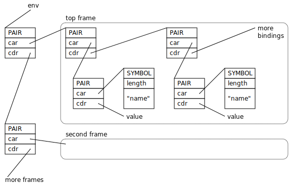

.. highlight:: none

.. index::
   single: debugging

.. _guide-debug:

Debugging with the Memory Pool System
=====================================

Memory management errors are some of the most stubborn and difficult
to track down, because the effect so often appears at a distant point
in the program that is seemingly unrelated to the cause, and by the
time the error is revealed, the information needed to reconstruct the
cause has long vanished. Immediately after an :term:`overwriting
error`, the block that overran its bounds is fine, and the block that
was overwritten may not be visited for a long time. A failure to
:term:`fix` a :term:`reference` does not necessarily cause the object
pointed to by the missed reference to die immediately: there may be
other references to that object, or a garbage collection may be
delayed. And even if it does die, the space it occupies may not be
re-allocated for some time.

.. _guide-debug-advice:

General debugging advice
------------------------

#. Compile with debugging information turned on (``-g`` on the GCC or
   Clang command line).

#. .. index::
      single: cool variety
      single: variety; cool

   Build the :term:`cool` :term:`variety` of the MPS (by defining the
   preprocessor constant :c:macro:`CONFIG_VAR_COOL`, for example by
   setting ``-DCONFIG_VAR_COOL`` on the GCC or Clang command line).
   This variety contains many internal consistency checks (including
   such checks on the :term:`critical path`, which make it too slow
   for use in production), and can generate profiling output in the
   form of the :term:`telemetry stream`.

#. If your program triggers an assertion failure in the MPS, consult
   :ref:`topic-error-cause` for suggestions as to the possible cause.

#. Prepare a reproducible test case if possible. The MPS may be
   :term:`asynchronous <asynchronous garbage collector>`, but it is
   deterministic, so in single-threaded applications you should be
   able to get consistent results.

   However, you need to beware of :term:`address space layout
   randomization`: if you perform computation based on the addresses
   of objects, for example, hashing objects by their address, then
   ASLR will cause your hash tables to be laid out differently on each
   run, which may affect the order of memory management operations.
   See :ref:`guide-debug-aslr` below.

   A fact that assists with reproducibility is that the more
   frequently the collector runs, the sooner and more reliably errors
   are discovered. So if you have a bug that's hard to reproduce, or
   which manifests itself in different ways on different runs, you may
   be able to provoke it more reliably, or get a more consistent
   result, by having a mode for testing in which you run frequent
   collections (by calling :c:func:`mps_arena_collect` followed by
   :c:func:`mps_arena_release`), perhaps as frequently as every
   allocation. (This will of course make the system run very slowly,
   but it ensures that if there are roots or references that are not
   being scanned then the failure will occur close in time to the cause,
   making it easier to diagnose.)

#. .. index::
      single: debugger
      single: abort

   Run your test case inside the debugger. Use :c:func:`assert` and
   :c:func:`abort` in your error handler (rather than :c:func:`exit`)
   so that you can enter the debugger with the contents of the control
   stack available for inspection.

#. .. index::
      single: barrier; handling in GDB
      single: signal; handling in GDB

   If you are using GDB on FreeBSD or Linux, you may want to avoid
   stopping on :term:`barrier (1)` hits, because the MPS uses barriers
   to protect parts of memory, and barrier hits are common and
   expected. To avoid stopping on a barrier hit, run::

        handle SIGSEGV pass nostop noprint

   You can add this command to your ``.gdbinit`` if you always want it
   to be run.

   On macOS and Windows, barrier hits do not use signals and so do not
   enter the debugger.

#. .. index::
      single: thread; handling in GDB

   Similarly, if you are using GDB on FreeBSD or Linux, and if the
   :term:`client program` is multi-threaded, you may want to avoid
   stopping when the MPS suspends and resumes threads by delivering
   signals to them. To avoid stopping on thread suspension and
   resumption, run::

        handle SIGXCPU pass nostop noprint
        handle SIGXFSZ pass nostop noprint

   If you have configured these signals as described under
   :ref:`topic-thread-signal`, you will need to adjust the signal
   names accordingly.

   On macOS and Windows, thread suspension and resumption does not use
   signals and so does not enter the debugger.

#. .. index::
       single: postmortem debugging
       single: postmortem state

   If the :term:`client program` is stopped in the debugger with the
   MPS part of the way through execution of an operation in an
   :term:`arena` (for example, a crash inside a :term:`scan method`),
   it will not be possible to call introspection functions, such as
   :c:func:`mps_arena_has_addr` or :c:func:`mps_addr_pool` (because
   the MPS is not re-entrant), and it may not be possible to examine
   some regions of memory (because they are :term:`protected` by the
   MPS).

   If you are in this situation and would like to be able to call MPS
   functions or examine regions of memory from the debugger, then you
   can put the arena into the :term:`postmortem state` by calling
   :c:func:`mps_arena_postmortem` from the debugger. This unlocks the
   arena and turns off protection.

   .. warning::

       After calling :c:func:`mps_arena_postmortem`, MPS-managed
       memory is not in a consistent state, and so it is not safe to
       continue running the client program.

.. index::
      single: ASLR
      single: address space layout randomization

.. _guide-debug-aslr:

Address space layout randomization
----------------------------------

:term:`Address space layout randomization` (ASLR) makes it hard to
prepare a repeatable test case for a program that performs computation
based on the addresses of objects, for example, hashing objects by
their address. If this is affecting you, you'll find it useful to
disable ASLR when testing.

Here's a small program that you can use to check if ASLR is enabled on
your system. It outputs addresses from four key memory areas in a
program (data segment, text segment, stack and heap):

.. code-block:: c

    #include <stdio.h>
    #include <stdlib.h>

    int data;

    int main() {
        void *heap = malloc(4);
        int stack = 0;
        printf("data: %p text: %p stack: %p heap: %p\n",
               &data, (void *)main, &stack, heap);
        return 0;
    }

When ASLR is turned on, running this program outputs different
addresses on each run. For example, here are four runs on macOS
10.9.3::

    data: 0x10a532020 text: 0x10a531ed0 stack: 0x7fff556ceb1c heap: 0x7f9f80c03980
    data: 0x10d781020 text: 0x10d780ed0 stack: 0x7fff5247fb1c heap: 0x7fe498c03980
    data: 0x10164b020 text: 0x10164aed0 stack: 0x7fff5e5b5b1c heap: 0x7fb783c03980
    data: 0x10c7f8020 text: 0x10c7f7ed0 stack: 0x7fff53408b1c heap: 0x7f9740403980

By contrast, here are four runs on FreeBSD 8.3::

    data: 0x8049728 text: 0x8048470 stack: 0xbfbfebfc heap: 0x28201088
    data: 0x8049728 text: 0x8048470 stack: 0xbfbfebfc heap: 0x28201088
    data: 0x8049728 text: 0x8048470 stack: 0xbfbfebfc heap: 0x28201088
    data: 0x8049728 text: 0x8048470 stack: 0xbfbfebfc heap: 0x28201088

Here's the situation on each of the operating systems supported by the MPS:

* **FreeBSD** (as of version 10.0) does not support ASLR, so there's
  nothing to do.

* On **Windows** (Vista or later), ASLR is a property of the
  executable, and it can be turned off at link time using the
  |DYNAMICBASE|_.

  .. |DYNAMICBASE| replace:: ``/DYNAMICBASE:NO`` linker option
  .. _DYNAMICBASE: https://docs.microsoft.com/en-us/cpp/build/reference/dynamicbase

* On **Linux** (kernel version 2.6.12 or later), ASLR can be turned
  off for a single process by running |setarch|_ with the ``-R``
  option::

      -R, --addr-no-randomize
             Disables randomization of the virtual address space

  .. |setarch| replace:: ``setarch``
  .. _setarch: http://man7.org/linux/man-pages/man8/setarch.8.html

  For example::

      $ setarch $(uname -m) -R ./myprogram

* On **macOS** (10.7 or later), ASLR can be disabled for a single
  process by starting the process using :c:func:`posix_spawn`, passing
  the undocumented attribute ``0x100``, like this:

  .. code-block:: c

      #include <spawn.h>

      pid_t pid;
      posix_spawnattr_t attr;

      posix_spawnattr_init(&attr);
      posix_spawnattr_setflags(&attr, 0x100);
      posix_spawn(&pid, argv[0], NULL, &attr, argv, environ);

  The MPS provides the source code for a command-line tool
  implementing this (``tool/noaslr.c``). We've confirmed that this
  works on macOS 10.9.3, but since the technique is undocumented, it
  may well break in future releases. (If you know of a documented way
  to achieve this, please :ref:`contact us <contact>`.)

.. index::
   single: underscanning
   single: bug; underscanning

.. _guide-debug-underscanning:

Example: underscanning
----------------------

An easy mistake to make is to omit to :term:`fix` a :term:`reference`
when :term:`scanning <scan>` a :term:`formatted object`. For example,
in the Scheme interpreter's :ref:`scan method <guide-lang-scan>`, I
might have forgotten to fix the first element of a pair:

.. code-block:: c
    :emphasize-lines: 3

    case TYPE_PAIR:
    case TYPE_PROMISE:
      /* oops, forgot: FIX(CAR(obj)); */
      FIX(CDR(obj));
      base = (char *)base + ALIGN_OBJ(sizeof(pair_s));
      break;

This means that as far as the MPS is concerned, the first element of
the pair is :term:`unreachable` and so :term:`dead`, so after
collecting the region of memory containing this object, the space will
be reused for other objects. So ``CAR(obj)`` might end up
pointing to the start of a valid object (but the wrong one), or to the
middle of a valid object, or to an unused region of memory, or into an
MPS internal control structure.

The reproducible test case is simple. Run a garbage collection by
calling ``(gc)`` and then evaluate any expression::

    $ gdb -q ./scheme
    Reading symbols from ./scheme...done.
    (gdb) run
    Starting program: /home/grees/github.com/mps/example/scheme/scheme
    MPS Toy Scheme Example
    The prompt shows total allocated bytes and number of collections.
    Try (vector-length (make-vector 100000 1)) to see the MPS in action.
    You can force a complete garbage collection with (gc).
    If you recurse too much the interpreter may crash from using too much C stack.
    13248, 0> (gc)
    Collection started.
      Why: Client requests: immediate full collection.
      Clock: 1819
    Collection finished.
        live 5272
        condemned 16384
        not_condemned 0
        clock: 1987
    13272, 1> foo
    scheme: scheme.c:1421: lookup_in_frame: Assertion `TYPE(CAAR(frame)) == TYPE_SYMBOL' failed.

    Program received signal SIGABRT, Aborted.
    __GI_raise (sig=sig@entry=6) at ../sysdeps/unix/sysv/linux/raise.c:51
    51	../sysdeps/unix/sysv/linux/raise.c: No such file or directory.

What's going on? ::

    (gdb) backtrace
    #0  __GI_raise (sig=sig@entry=6) at ../sysdeps/unix/sysv/linux/raise.c:51
    #1  0x00007ffff78058b1 in __GI_abort () at abort.c:79
    #2  0x00007ffff77f542a in __assert_fail_base (fmt=0x7ffff797ca38 "%s%s%s:%u: %s%sAssertion `%s' failed.\n%n", assertion=assertion@entry=0x555555604050 "TYPE(CAAR(frame)) == TYPE_SYMBOL", file=file@entry=0x555555603bb2 "scheme.c", line=line@entry=1421, function=function@entry=0x555555605390 <__PRETTY_FUNCTION__.3661> "lookup_in_frame") at assert.c:92
    #3  0x00007ffff77f54a2 in __GI___assert_fail (assertion=0x555555604050 "TYPE(CAAR(frame)) == TYPE_SYMBOL", file=0x555555603bb2 "scheme.c", line=1421, function=0x555555605390 <__PRETTY_FUNCTION__.3661> "lookup_in_frame") at assert.c:101
    #4  0x000055555555d0d8 in lookup_in_frame (frame=0x7ffff5900bb8, symbol=0x7ffff5883418) at scheme.c:1421
    #5  0x000055555555d16c in lookup (env=0x7ffff5880180, symbol=0x7ffff5883418) at scheme.c:1440
    #6  0x000055555555d2d1 in eval (env=0x7ffff5880180, op_env=0x7ffff5880198, exp=0x7ffff5883418) at scheme.c:1487
    #7  0x0000555555564f29 in start (argc=0, argv=0x7fffffffe0d0) at scheme.c:4341
    #8  0x0000555555565717 in main (argc=0, argv=0x7fffffffe0d0) at scheme.c:4489
    (gdb) frame 4
    #4  0x000055555555d0d8 in lookup_in_frame (frame=0x7ffff5900bb8, symbol=0x7ffff5883418) at scheme.c:1421
    1421	    assert(TYPE(CAAR(frame)) == TYPE_SYMBOL);
    (gdb) print (char *)symbol->symbol.string
    $1 = 0x7ffff5883428 "foo"

The backtrace shows that the interpreter is in the middle of looking
up the symbol ``foo`` in the environment. The Scheme interpreter
implements the environment as a list of *frames*, each of which is a
list of *bindings*, each binding being a pair of a symbol and its
value, as shown here:

    The environment data structure in the Scheme interpreter.

In this case, because the evaluation is taking place at top level,
there is only one frame in the environment (the global frame). And
it's this frame that's corrupt:

.. code-block:: none
    :emphasize-lines: 7

    (gdb) list
    1416	static obj_t lookup_in_frame(obj_t frame, obj_t symbol)
    1417	{
    1418	  while(frame != obj_empty) {
    1419	    assert(TYPE(frame) == TYPE_PAIR);
    1420	    assert(TYPE(CAR(frame)) == TYPE_PAIR);
    1421	    assert(TYPE(CAAR(frame)) == TYPE_SYMBOL);
    1422	    if(CAAR(frame) == symbol)
    1423	      return CAR(frame);
    1424	    frame = CDR(frame);
    1425	  }
    (gdb) print CAAR(frame)->type.type
    $3 = 13

The number 13 is the value :c:data:`TYPE_PAD`. So instead of the
expected symbol, ``CAAR(frame)`` points to a :term:`padding object`.

You might guess at this point that the symbol had not been fixed, and
since you know that the frame is referenced by the :c:member:`car` of
the first pair in the environment, that's the suspect reference. But
in a more complex situation this might not yet be clear. In such a
situation it can be useful to look at the sequence of events leading
up to the detection of the error. See :ref:`topic-telemetry`.

.. index::
   single: bug; allocating with wrong size

.. _guide-debug-size:

Example: allocating with wrong size
-----------------------------------

Here's another kind of mistake: an off-by-one error in
:c:func:`make_string` leading to the allocation of string objects with
the wrong size:

.. code-block:: c
    :emphasize-lines: 5

    static obj_t make_string(size_t length, const char *string)
    {
      obj_t obj;
      mps_addr_t addr;
      size_t size = ALIGN_OBJ(offsetof(string_s, string) + length /* oops, forgot +1 */);
      do {
        mps_res_t res = mps_reserve(&addr, obj_ap, size);
        if (res != MPS_RES_OK) error("out of memory in make_string");
        obj = addr;
        obj->string.type = TYPE_STRING;
        obj->string.length = length;
        if (string) memcpy(obj->string.string, string, length+1);
        else memset(obj->string.string, 0, length+1);
      } while(!mps_commit(obj_ap, addr, size));
      total += size;
      return obj;
    }

Here's a test case that exercises this bug:

.. code-block:: scheme

    (define (church n f a) (if (eqv? n 0) a (church (- n 1) f (f a))))
    (church 1000 (lambda (s) (string-append s "x")) "")

And here's how it shows up in the debugger:

.. code-block:: none
    :emphasize-lines: 53

    $ gdb -q ./scheme
    Reading symbols from ./scheme...done.
    (gdb) run < test.scm
    Starting program: /home/grees/github.com/mps/example/scheme/scheme < test.scm
    [Thread debugging using libthread_db enabled]
    Using host libthread_db library "/lib/x86_64-linux-gnu/libthread_db.so.1".
    MPS Toy Scheme Example
    The prompt shows total allocated bytes and number of collections.
    Try (vector-length (make-vector 100000 1)) to see the MPS in action.
    You can force a complete garbage collection with (gc).
    If you recurse too much the interpreter may crash from using too much C stack.
    13248, 0> church
    14104, 0> scheme: scheme.c:4067: obj_skip: Assertion `0' failed.

    Program received signal SIGABRT, Aborted.
    __GI_raise (sig=sig@entry=6) at ../sysdeps/unix/sysv/linux/raise.c:51
    51	../sysdeps/unix/sysv/linux/raise.c: No such file or directory.
    (gdb) backtrace
    #0  __GI_raise (sig=sig@entry=6) at ../sysdeps/unix/sysv/linux/raise.c:51
    #1  0x00007ffff78058b1 in __GI_abort () at abort.c:79
    #2  0x00007ffff77f542a in __assert_fail_base (fmt=0x7ffff797ca38 "%s%s%s:%u: %s%sAssertion `%s' failed.\n%n", assertion=assertion@entry=0x555555603e0f "0", file=file@entry=0x555555603c32 "scheme.c", line=line@entry=4067, function=function@entry=0x555555605568 <__PRETTY_FUNCTION__.4815> "obj_skip") at assert.c:92
    #3  0x00007ffff77f54a2 in __GI___assert_fail (assertion=0x555555603e0f "0", file=0x555555603c32 "scheme.c", line=4067, function=0x555555605568 <__PRETTY_FUNCTION__.4815> "obj_skip") at assert.c:101
    #4  0x000055555556434b in obj_skip (base=0x7ffff58af898) at scheme.c:4067
    #5  0x00005555555e15bf in amcSegScanNailedRange (totalReturn=0x7fffffffd4a0, moreReturn=0x7fffffffd4a4, ss=0x7fffffffd5f0, amc=0x7ffff57f73f8, board=0x7ffff57f8a40, base=0x7ffff58ae000, limit=0x7ffff58afff0) at ../../code/poolamc.c:1278
    #6  0x00005555555e177b in amcSegScanNailedOnce (totalReturn=0x7fffffffd4a0, moreReturn=0x7fffffffd4a4, ss=0x7fffffffd5f0, seg=0x7ffff57f89a8, amc=0x7ffff57f73f8) at ../../code/poolamc.c:1325
    #7  0x00005555555e187c in amcSegScanNailed (totalReturn=0x7fffffffd5d0, ss=0x7fffffffd5f0, pool=0x7ffff57f73f8, seg=0x7ffff57f89a8, amc=0x7ffff57f73f8) at ../../code/poolamc.c:1355
    #8  0x00005555555e1bd3 in amcSegScan (totalReturn=0x7fffffffd5d0, seg=0x7ffff57f89a8, ss=0x7fffffffd5f0) at ../../code/poolamc.c:1413
    #9  0x0000555555599188 in SegScan (totalReturn=0x7fffffffd5d0, seg=0x7ffff57f89a8, ss=0x7fffffffd5f0) at ../../code/seg.c:778
    #10 0x000055555558c926 in traceScanSegRes (ts=1, rank=1, arena=0x7ffff7ff7000, seg=0x7ffff57f89a8) at ../../code/trace.c:1148
    #11 0x000055555558cb2d in traceScanSeg (ts=1, rank=1, arena=0x7ffff7ff7000, seg=0x7ffff57f89a8) at ../../code/trace.c:1223
    #12 0x000055555558e24d in TraceAdvance (trace=0x7ffff7ff7ac0) at ../../code/trace.c:1664
    #13 0x000055555558e792 in TracePoll (workReturn=0x7fffffffd7b0, collectWorldReturn=0x7fffffffd78c, globals=0x7ffff7ff7008, collectWorldAllowed=1) at ../../code/trace.c:1784
    #14 0x000055555557c990 in ArenaPoll (globals=0x7ffff7ff7008) at ../../code/global.c:760
    #15 0x00005555555690ed in mps_ap_fill (p_o=0x7fffffffd940, mps_ap=0x7ffff57f7928, size=24) at ../../code/mpsi.c:1111
    #16 0x0000555555559c93 in make_pair (car=0x7ffff58afbf0, cdr=0x7ffff5880000) at scheme.c:457
    #17 0x000055555555d605 in eval_list (env=0x7ffff58afed0, op_env=0x7ffff58afee8, list=0x7ffff5883828, message=0x5555556041f8 "eval: badly formed argument list") at scheme.c:1564
    #18 0x000055555555d94b in eval_args_rest (name=0x555555604e02 "string-append", env=0x7ffff58afed0, op_env=0x7ffff58afee8, operands=0x7ffff5883828, restp=0x7fffffffdb00, n=0) at scheme.c:1637
    #19 0x0000555555562870 in entry_string_append (env=0x7ffff58afed0, op_env=0x7ffff58afee8, operator=0x7ffff5882340, operands=0x7ffff5883828) at scheme.c:3396
    #20 0x000055555555d420 in eval (env=0x7ffff58afed0, op_env=0x7ffff58afee8, exp=0x7ffff5883810) at scheme.c:1511
    #21 0x000055555555dbc8 in entry_interpret (env=0x7ffff58af9e0, op_env=0x7ffff58af9f8, operator=0x7ffff5883700, operands=0x7ffff5883670) at scheme.c:1713
    #22 0x000055555555d420 in eval (env=0x7ffff58af9e0, op_env=0x7ffff58af9f8, exp=0x7ffff5883598) at scheme.c:1511
    #23 0x0000555555564fab in start (argc=0, argv=0x7fffffffe0d0) at scheme.c:4341
    #24 0x0000555555565799 in main (argc=0, argv=0x7fffffffe0d0) at scheme.c:4489
    (gdb) frame 4
    #4  0x000055555556434b in obj_skip (base=0x7ffff58af898) at scheme.c:4067
    4067	    assert(0);
    (gdb) list
    4062	    break;
    4063	  case TYPE_PAD1:
    4064	    base = (char *)base + ALIGN_WORD(sizeof(pad1_s));
    4065	    break;
    4066	  default:
    4067	    assert(0);
    4068	    fflush(stdout);
    4069	    fprintf(stderr, "Unexpected object on the heap\n");
    4070	    abort();
    4071	  }

The object being skipped is corrupt::

    (gdb) print obj->type.type
    $1 = -175623000

What happened to it? It's often helpful in these situations to have a
look at nearby memory. ::

    (gdb) x/20gx obj
    0x7ffff58af898:	0x00007ffff58834a8	0x00007ffff58af7c8
    0x7ffff58af8a8:	0x0000000000000000	0x00007ffff58af890
    0x7ffff58af8b8:	0x00007ffff58af660	0x0000000000000000
    0x7ffff58af8c8:	0x00007ffff58836e8	0x00007ffff5880000
    0x7ffff58af8d8:	0x0000000000000000	0x00007ffff58af5d0
    0x7ffff58af8e8:	0x00007ffff58af8c0	0x0000000000000000
    0x7ffff58af8f8:	0x00007ffff58af5b8	0x00007ffff58af8d8
    0x7ffff58af908:	0x0000000000000000	0x00007ffff5880090
    0x7ffff58af918:	0x00007ffff58af8f0	0x0000000000000000
    0x7ffff58af928:	0x00007ffff58834f0	0x00007ffff5880000

You can see that this is a region of memory containing pairs, which
have type :c:data:`TYPE_PAIR` = 0 and consist of three words. But
what's that at the start of the region, where :c:data:`obj`\'s tag
should be? It looks like a pointer. So what's in the memory just below
:c:data:`obj`? Let's look at the previous region of memory::

    (gdb) x/30gx (mps_word_t*)obj-28
    0x7ffff58af7b8:	0x00007ffff5883840	0x00007ffff5880000
    0x7ffff58af7c8:	0x0000000000000005	0x00000000000000b8
    0x7ffff58af7d8:	0x7878787878787878	0x7878787878787878
    0x7ffff58af7e8:	0x7878787878787878	0x7878787878787878
    0x7ffff58af7f8:	0x7878787878787878	0x7878787878787878
    0x7ffff58af808:	0x7878787878787878	0x7878787878787878
    0x7ffff58af818:	0x7878787878787878	0x7878787878787878
    0x7ffff58af828:	0x7878787878787878	0x7878787878787878
    0x7ffff58af838:	0x7878787878787878	0x7878787878787878
    0x7ffff58af848:	0x7878787878787878	0x7878787878787878
    0x7ffff58af858:	0x7878787878787878	0x7878787878787878
    0x7ffff58af868:	0x7878787878787878	0x7878787878787878
    0x7ffff58af878:	0x7878787878787878	0x7878787878787878
    0x7ffff58af888:	0x7878787878787878	0x0000000000000000
    0x7ffff58af898:	0x00007ffff58834a8	0x00007ffff58af7c8

In this region we can see a string starting at address
``0x7ffff58af7c8``. Its type is :c:data:`TYPE_STRING` = 5, its length
is 0xb8 = 184, and its contents is 184 repetitions of the byte 0x78
(ASCII for "x") resulting from the repeated ``(string-append s "x")``
in the test code. The string is followed by a pair (with type 0) at
the address ``0x7ffff58af890``, which is one word before
:c:data:`obj`. So it looks as though :c:data:`obj` should be pointing
at the pair, but its value is one word too low.

The value in :c:data:`obj` comes from skipping the string object::

    (gdb) print obj_skip(0x7ffff58af7c8)
    $3 = (void *) 0x7ffff58af898

So either :c:func:`obj_skip` has skipped one word too far, or the
string object is one word too short. This should be enough evidence to
track down the cause.

What next?
----------

If you tracked down all your bugs, then the next step is the chapter
:ref:`guide-perf`.

But if you're still struggling, please :ref:`contact us <contact>` and
see if we can help.
