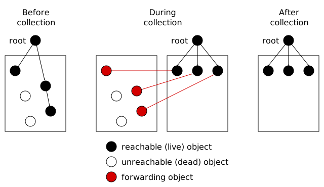

.. index::
   single: Memory Pool System; tutorial

.. _guide-lang:

Garbage collecting a language with the Memory Pool System
=========================================================

Have you written the lexer, parser, code generator and the runtime
system for your programming language, and come to the realization that
you are going to need a memory manager too? If so, you've come to the
right place.

In this guide, I'll explain how to use the MPS to add incremental,
moving, generational garbage collection to the runtime system for a
programming language.

I'm assuming that you are familiar with the overall architecture of
the MPS (see the chapter :ref:`guide-overview`) and that you've
downloaded and built the MPS (see the chapter :ref:`guide-build`).

.. index::
   single: Scheme; toy interpreter

The Scheme interpreter
----------------------

As a running example throughout this guide, I'll be using a small
interpreter for a subset of the :term:`Scheme` programming language.
I'll be quoting the relevant sections of code as needed, but you may
find it helpful to experiment with this interpreter yourself, in either
of its versions:

:download:`scheme-malloc.c <../../../example/scheme/scheme-malloc.c>`

    The toy Scheme interpreter before integration with the MPS, using
    :term:`malloc` and :term:`free (2)` for memory management.

:download:`scheme.c <../../../example/scheme/scheme.c>`

    The toy Scheme interpreter after integration with the MPS.

This simple interpreter allocates two kinds of objects on the
:term:`heap`:

#. All Scheme objects (there are no :term:`unboxed` objects).

#. The global symbol table: a hash table consisting of a vector of
   pointers to strings.

A Scheme object (whose type is not necessarily known) is represented by
an ``obj_t``, which is a pointer to a union of every type in the
language::

    typedef union obj_u *obj_t;
    typedef union obj_u {
        type_s type;
        pair_s pair;
        symbol_s symbol;
        integer_s integer;
        special_s special;
        operator_s operator;
        string_s string;
        port_s port;
        character_s character;
        vector_s vector;
        table_s table;
        buckets_s buckets;
    } obj_s;

Each of these types is a structure whose first word is a number
specifying the type of the object (``TYPE_PAIR`` for pairs,
``TYPE_SYMBOL`` for symbols, and so on). For example, pairs are
represented by a pointer to the structure ``pair_s`` defined as
follows::

    typedef struct pair_s {
        type_t type;        /* TYPE_PAIR */
        obj_t car, cdr;     /* first and second projections */
    } pair_s;

Because the first word of every object is its type, functions can
operate on objects generically, testing ``TYPE(obj)`` as necessary
(which is a macro for ``obj->type.type``). For example, the
``print()`` function is implemented like this::

    static void print(obj_t obj, unsigned depth, FILE *stream)
    {
        switch (TYPE(obj)) {
        case TYPE_INTEGER:
            fprintf(stream, "%ld", obj->integer.integer);
            break;

        case TYPE_SYMBOL:
            fputs(obj->symbol.string, stream);
            break;

        /* ... and so on for the other types ... */
        }
    }

Each constructor allocates memory for the new object by calling
``malloc``. For example, ``make_pair`` is the constructor for pairs::

    static obj_t make_pair(obj_t car, obj_t cdr)
    {
        obj_t obj = (obj_t)malloc(sizeof(pair_s));
        if (obj == NULL) error("out of memory");
        obj->pair.type = TYPE_PAIR;
        CAR(obj) = car;
        CDR(obj) = cdr;
        return obj;
    }

Objects are never freed, because it is necessary to prove that they
are :term:`dead` before their memory can be :term:`reclaimed`. To
prove that they are dead, we need a :term:`tracing <trace>`
:term:`garbage collector`, which the MPS will provide.

.. index::
   single: arena class; choosing
   single: arena; creating

Choosing an arena class
-----------------------

You'll recall from the :ref:`guide-overview` that the functionality of
the MPS is divided between the :term:`arenas`, which request memory
from (and return it to) the operating system, and :term:`pools`, which
allocate blocks of memory for your program.

There are two main classes of arena: the :term:`client arena`,
:c:func:`mps_arena_class_cl`, which gets its memory from your program,
and the :term:`virtual memory arena`, :c:func:`mps_arena_class_vm`,
which gets its memory from the operating system's :term:`virtual
memory` interface.

The client arena is intended for use on embedded systems where there
is no virtual memory, and has a couple of disadvantages (you have to
decide how much memory you are going to use; and the MPS can't return
memory to the operating system for use by other processes) so for
general-purpose programs you'll want to use the virtual memory arena.

You'll need a couple of headers: ``mps.h`` for the MPS interface, and
``mpsavm.h`` for the virtual memory arena class::

    #include "mps.h"
    #include "mpsavm.h"

There's only one arena, and many MPS functions take an arena as an
argument, so it makes sense for the arena to be a global variable
rather than having to pass it around everywhere::

    static mps_arena_t arena;

Create an arena by calling :c:func:`mps_arena_create_k`. This function
takes a :term:`keyword argument` when creating a virtual memory arena:
the size of virtual :term:`address space` (*not* :term:`RAM`), in
bytes, that the arena will reserve initially. The MPS will ask for
more address space if it runs out, but the more times it has to extend
its address space, the less efficient garbage collection will become.
The MPS works best if you reserve an address space that is several
times larger than your peak memory usage.

.. note::

    Functions in the MPS interface take :term:`keyword arguments` for
    arguments that are optional, or are only required in some
    circumstances. These argument are passed in the form of an array
    of structures of type :c:type:`mps_arg_s`. See
    :ref:`topic-keyword` for the full details.

Let's reserve 32 megabytes::

    mps_res_t res;
    MPS_ARGS_BEGIN(args) {
        MPS_ARGS_ADD(args, MPS_KEY_ARENA_SIZE, 32 * 1024 * 1024);
        res = mps_arena_create_k(&arena, mps_arena_class_vm(), args);
    } MPS_ARGS_END(args);
    if (res != MPS_RES_OK) error("Couldn't create arena");

:c:func:`mps_arena_create_k` is typical of functions in the MPS
interface in that it stores its result in a location pointed to by an
:term:`out parameter` (here, ``&arena``) and returns a :term:`result
code`, which is :c:macro:`MPS_RES_OK` if the function succeeded, or
some other value if it failed.

.. note::

    The MPS is designed to co-operate with other memory managers, so
    when integrating your language with the MPS you need not feel
    obliged to move all your memory management to the MPS: you can
    continue to use ``malloc`` and ``free`` to manage some of your
    memory, for example, while using the MPS for the rest.

    The toy Scheme interpreter illustrates this by continuing to use
    ``malloc`` and ``free`` to manage its global symbol table.

.. topics::

    :ref:`topic-arena`, :ref:`topic-error`.

.. index::
   single: pool class; choosing

Choosing a pool class
---------------------

Pool classes come with a policy for how their memory will be managed:
some pool classes use :term:`automatic memory management` and others
use :term:`manual <manual memory management>`; some use :term:`moving
collection <moving garbage collector>` and others :term:`non-moving
<non-moving garbage collector>`.

The section :ref:`pool-choose` in the :ref:`pool` contains a procedure
for choosing a pool class. In the case of the toy Scheme interpreter,
the answers to the questions are (1) yes, the MPS needs to
automatically reclaim unreachable blocks; (2) yes, it's acceptable for
the MPS to move blocks in memory and protect them with :term:`barriers
(1)`; and (3) the Scheme objects will contain :term:`exact references`
to other Scheme objects in the same pool.

The recommended class is :ref:`pool-amc`. This pool class uses
automatic memory management, moving garbage collection,
:term:`allocation points` and :term:`formatted objects`, so it will
provide an introduction to these features of the MPS.

.. note::

    The MPS is designed for pools of different classes to co-exist in
    the same arena, so that objects requiring different memory
    management policies can be segregated into pools of suitable
    classes.

.. topics::

    :ref:`topic-pool`.

.. index::
   single: object format
   single: format; object
   single: Scheme; object format

Describing your objects
-----------------------

In order for the MPS to be able to automatically manage your objects,
you need to tell it how to perform various operations on an object
(:term:`scan` it for :term:`references`; replace it with a
:term:`forwarding <forwarding object>` or :term:`padding object`, and
so on). You do this by creating an :term:`object format`. Here's the
code for creating the object format for the toy Scheme interpreter::

    MPS_ARGS_BEGIN(args) {
        MPS_ARGS_ADD(args, MPS_KEY_FMT_ALIGN, ALIGNMENT);
        MPS_ARGS_ADD(args, MPS_KEY_FMT_SCAN, obj_scan);
        MPS_ARGS_ADD(args, MPS_KEY_FMT_SKIP, obj_skip);
        MPS_ARGS_ADD(args, MPS_KEY_FMT_FWD, obj_fwd);
        MPS_ARGS_ADD(args, MPS_KEY_FMT_ISFWD, obj_isfwd);
        MPS_ARGS_ADD(args, MPS_KEY_FMT_PAD, obj_pad);
        res = mps_fmt_create_k(&obj_fmt, arena, args);
    } MPS_ARGS_END(args);
    if (res != MPS_RES_OK) error("Couldn't create obj format");

The argument for the keyword :c:macro:`MPS_KEY_FMT_ALIGN` is the
:term:`alignment` of objects belonging to this format. Determining the
alignment is hard to do portably, because it depends on the target
architecture and on the way the compiler lays out its structures in
memory. Here are some things you might try:

#. Some modern compilers support the ``alignof`` operator::

        #define ALIGNMENT alignof(obj_s)

#. On older compilers you may be able to use this trick::

        #define ALIGNMENT offsetof(struct {char c; obj_s obj;}, obj)

   but this is not reliable because some compilers pack structures
   more tightly than their alignment requirements in some
   circumstances (for example, GCC if the ``-fstruct-pack`` option is
   specified).

#. The MPS interface provides the type :c:type:`mps_word_t`, which is
   an unsigned integral type that is the same size as the platform's
   :term:`object pointer` types.

   So if you know that all your objects can be word-aligned, you can
   use::

        #define ALIGNMENT sizeof(mps_word_t)

The other keyword arguments specify the :term:`format methods`
required by the AMC pool class, which are described in the following
sections.

.. topics::

    :ref:`topic-format`.

.. index::
   single: scan method
   single: format method; scan
   single: Scheme; scan method

.. _guide-lang-scan:

The scan method
^^^^^^^^^^^^^^^

The :term:`scan method` is a function of type
:c:type:`mps_fmt_scan_t`. It is called by the MPS to :term:`scan` a
block of memory. Its task is to identify all references within the
objects in the block of memory, and "fix" them, by calling the macros
:c:func:`MPS_FIX1` and :c:func:`MPS_FIX2` on each reference (possibly
via the convenience macro :c:func:`MPS_FIX12`).

"Fixing" is a generic operation whose effect depends on the context in
which the scan method was called. The scan method is called to
discover references and so determine which objects are :term:`alive
<live>` and which are :term:`dead`, and also to update references
after objects have been moved.

Here's the scan method for the toy Scheme interpreter::

    static mps_res_t obj_scan(mps_ss_t ss, mps_addr_t base, mps_addr_t limit)
    {
        MPS_SCAN_BEGIN(ss) {
            while (base < limit) {
                obj_t obj = base;
                switch (TYPE(obj)) {
                case TYPE_PAIR:
                    FIX(CAR(obj));
                    FIX(CDR(obj));
                    base = (char *)base + ALIGN_OBJ(sizeof(pair_s));
                    break;
                case TYPE_INTEGER:
                    base = (char *)base + ALIGN_OBJ(sizeof(integer_s));
                    break;
                /* ... and so on for the other types ... */
                default:
                    assert(0);
                    fprintf(stderr, "Unexpected object on the heap\n");
                    abort();
                }
            }
        } MPS_SCAN_END(ss);
        return MPS_RES_OK;
    }

The scan method receives a :term:`scan state` (``ss``) argument, and
the block of memory to scan, from ``base`` (inclusive) to ``limit``
(exclusive). This block of memory is known to be packed with objects
belonging to the object format, and so the scan method loops over the
objects in the block, dispatching on the type of each object, and then
updating ``base`` to point to the next object in the block.

For each reference in an object ``obj_scan`` fixes it by calling
:c:func:`MPS_FIX12` via the macro ``FIX``, which is defined as
follows::

    #define FIX(ref)                                                        \
        do {                                                                \
            mps_addr_t _addr = (ref); /* copy to local to avoid type pun */ \
            mps_res_t res = MPS_FIX12(ss, &_addr);                          \
            if (res != MPS_RES_OK) return res;                              \
            (ref) = _addr;                                                  \
        } while (0)

Each call to :c:func:`MPS_FIX12` must appear between calls to the
macros :c:func:`MPS_SCAN_BEGIN` and :c:func:`MPS_SCAN_END`. It's
usually most convenient to call :c:func:`MPS_SCAN_BEGIN` at the start
of the function and :c:func:`MPS_SCAN_END` at the end, as here.

.. note::

    1. When the MPS calls your scan method, it may be part-way through
       moving your objects. It is therefore essential that the scan
       method only examine objects in the range of addresses it is
       given. Objects in other ranges of addresses are not guaranteed
       to be in a consistent state.

    2. Scanning is an operation on the :term:`critical path` of the
       MPS, which means that it is important that it runs as quickly
       as possible.

    3. If your reference is :term:`tagged <tagged reference>`, you
       must remove the tag before fixing it. (This is not quite true,
       but see :ref:`topic-scanning-tag` for the full story.)

    4. The "fix" operation may update the reference. So if your
       reference is tagged, you must make sure that the tag is
       restored after the reference is updated.

    5. The "fix" operation may fail by returning a :term:`result code`
       other than :c:macro:`MPS_RES_OK`. A scan function must
       propagate such a result code to the caller, and should do so as
       soon as practicable.

.. topics::

    :ref:`topic-format`, :ref:`topic-scanning`.

.. index::
   single: skip method
   single: format method; skip
   single: Scheme; skip method

.. _guide-lang-skip:

The skip method
^^^^^^^^^^^^^^^

The :term:`skip method` is a function of type
:c:type:`mps_fmt_skip_t`. It is called by the MPS to skip over an
object belonging to the format, and also to determine its size.

Here's the skip method for the toy Scheme interpreter::

    static mps_addr_t obj_skip(mps_addr_t base)
    {
        obj_t obj = base;
        switch (TYPE(obj)) {
        case TYPE_PAIR:
            base = (char *)base + ALIGN_OBJ(sizeof(pair_s));
            break;
        case TYPE_INTEGER:
            base = (char *)base + ALIGN_OBJ(sizeof(integer_s));
            break;
        /* ... and so on for the other types ... */
        default:
            assert(0);
            fprintf(stderr, "Unexpected object on the heap\n");
            abort();
        }
        return base;
    }

The argument ``base`` is the address to the base of the object. The
skip method must return the address of the base of the "next object":
in formats of variant A like this one, this is the address just past
the end of the object, rounded up to the object format's alignment.

.. topics::

    :ref:`topic-format`.

.. index::
   single: forward method
   single: format method; forward
   single: Scheme; forward method

.. _guide-lang-fwd:

The forward method
^^^^^^^^^^^^^^^^^^

The :term:`forward method` is a function of type
:c:type:`mps_fmt_fwd_t`. It is called by the MPS after it has moved an
object, and its task is to replace the old object with a
:term:`forwarding object` pointing to the new location of the object.

    Copying garbage collection.

The forwarding object must satisfy these properties:

#. It must be scannable and skippable, and so it will need to have a
   type field to distinguish it from other Scheme objects.

#. It must contain a pointer to the new location of the object (a
   :term:`forwarding pointer`).

#. It must be the same size as the old object. This means that the
   :ref:`scan method <guide-lang-scan>` and the :ref:`skip method
   <guide-lang-skip>` will both need to know the length of the
   forwarding object. This can be arbitrarily long (in the case of
   string objects, for example) so it must contain a length field.

This poses a problem, because the above analysis suggests that
forwarding objects need to contain at least three words, but Scheme
objects might be as small as two words (for example, integers).

This conundrum can be solved by having two types of forwarding object.
The first type is suitable for forwarding objects of three words or
longer::

    typedef struct fwd_s {
        type_t type;                  /* TYPE_FWD */
        obj_t fwd;                    /* forwarded object */
        size_t size;                  /* total size of this object */
    } fwd_s;

while the second type is suitable for forwarding objects of two words::

    typedef struct fwd2_s {
        type_t type;                  /* TYPE_FWD2 */
        obj_t fwd;                    /* forwarded object */
    } fwd2_s;

Here's the forward method for the toy Scheme interpreter::

    static void obj_fwd(mps_addr_t old, mps_addr_t new)
    {
        obj_t obj = old;
        mps_addr_t limit = obj_skip(old);
        size_t size = (char *)limit - (char *)old;
        assert(size >= ALIGN_WORD(sizeof(fwd2_s)));
        if (size == ALIGN_WORD(sizeof(fwd2_s))) {
            TYPE(obj) = TYPE_FWD2;
            obj->fwd2.fwd = new;
        } else {
            TYPE(obj) = TYPE_FWD;
            obj->fwd.fwd = new;
            obj->fwd.size = size;
        }
    }

The argument ``old`` is the old address of the object, and ``new`` is
the location to which it has been moved.

The forwarding objects must be scannable and skippable, so the
following code must be added to ``obj_scan`` and ``obj_skip``::

    case TYPE_FWD:
        base = (char *)base + ALIGN_WORD(obj->fwd.size);
        break;
    case TYPE_FWD2:
        base = (char *)base + ALIGN_WORD(sizeof(fwd2_s));
        break;

.. note::

    Objects that consist of a single word present a problem for the
    design of the forwarding object. In the toy Scheme interpreter, this
    happens on some 64-bit platforms, where a pointer is 8 bytes long,
    and a ``character_s`` object (which consists of a 4-byte ``int``
    and a 1-byte ``char``) is also 8 bytes long.

    There are a couple of solutions to this problem:

    1. Allocate the small objects with enough padding so that they can
       be forwarded. (This is how the problem is solved in the toy
       Scheme interpreter.)

    2. Use a :term:`tag` to distinguish between the client object and
       a forwarding object that replaces it. It might help to allocate
       the small objects in their own pool so that the number of types
       that the scan method has to distinguish is minimized. Since
       these objects do not contain references, they could be
       allocated from the :ref:`pool-amcz` pool, and so the cost of
       scanning them could be avoided.

.. topics::

    :ref:`topic-format`.

.. index::
   single: is-forwarded method
   single: format method; is-forwarded
   single: Scheme; is-forwarded method

.. _guide-lang-isfwd:

The is-forwarded method
^^^^^^^^^^^^^^^^^^^^^^^

The :term:`is-forwarded method` is a function of type
:c:type:`mps_fmt_isfwd_t`. It is called by the MPS to determine if an
object is a :term:`forwarding object`, and if it is, to determine the
location where that object was moved.

Here's the is-forwarded method for the toy Scheme interpreter::

    static mps_addr_t obj_isfwd(mps_addr_t addr)
    {
        obj_t obj = addr;
        switch (TYPE(obj)) {
        case TYPE_FWD2:
            return obj->fwd2.fwd;
        case TYPE_FWD:
            return obj->fwd.fwd;
        }
        return NULL;
    }

It receives the address of an object, and returns the address to which
that object was moved, or ``NULL`` if the object was not moved.

.. topics::

    :ref:`topic-format`.

.. index::
   single: padding method
   single: format method; padding
   single: Scheme; padding method

.. _guide-lang-pad:

The padding method
^^^^^^^^^^^^^^^^^^

The :term:`padding method` is a function of type
:c:type:`mps_fmt_pad_t`. It is called by the MPS to fill a block of
memory with a :term:`padding object`: this is an object that fills
gaps in a block of :term:`formatted objects`, for
example to enable the MPS to pack objects into fixed-size units (such
as operating system :term:`pages`).

A padding object must be scannable and skippable, and not confusable
with a :term:`forwarding object`. This means they need a type and a
size. However, padding objects might need to be as small as the
alignment of the object format, which was specified to be a single
word. As with forwarding objects, this can be solved by having two
types of padding object. The first type is suitable for padding
objects of two words or longer::

    typedef struct pad_s {
        type_t type;                  /* TYPE_PAD */
        size_t size;                  /* total size of this object */
    } pad_s;

while the second type is suitable for padding objects consisting of a
single word::

    typedef struct pad1_s {
        type_t type;                  /* TYPE_PAD1 */
    } pad1_s;

Here's the padding method::

    static void obj_pad(mps_addr_t addr, size_t size)
    {
        obj_t obj = addr;
        assert(size >= ALIGN_OBJ(sizeof(pad1_s)));
        if (size == ALIGN_OBJ(sizeof(pad1_s))) {
            TYPE(obj) = TYPE_PAD1;
        } else {
            TYPE(obj) = TYPE_PAD;
            obj->pad.size = size;
        }
    }

The argument ``addr`` is the address at which the padding object must be created, and ``size`` is its size in bytes: this will always be a multiple of the alignment of the object format.

The padding objects must be scannable and skippable, so the following
code must be added to ``obj_scan`` and ``obj_skip``::

    case TYPE_PAD:
        base = (char *)base + ALIGN_OBJ(obj->pad.size);
        break;
    case TYPE_PAD1:
        base = (char *)base + ALIGN_OBJ(sizeof(pad1_s));
        break;

.. topics::

    :ref:`topic-format`.

.. index::
   single: pool; creating
   single: Scheme; pool

Creating the pool
-----------------

Now you know enough to create an :ref:`pool-amc` pool! Let's review
the pool creation code. First, the header for the AMC pool class::

    #include "mpscamc.h"

Second, the :term:`object format`::

    MPS_ARGS_BEGIN(args) {
        MPS_ARGS_ADD(args, MPS_KEY_FMT_ALIGN, ALIGNMENT);
        MPS_ARGS_ADD(args, MPS_KEY_FMT_SCAN, obj_scan);
        MPS_ARGS_ADD(args, MPS_KEY_FMT_SKIP, obj_skip);
        MPS_ARGS_ADD(args, MPS_KEY_FMT_FWD, obj_fwd);
        MPS_ARGS_ADD(args, MPS_KEY_FMT_ISFWD, obj_isfwd);
        MPS_ARGS_ADD(args, MPS_KEY_FMT_PAD, obj_pad);
        res = mps_fmt_create_k(&obj_fmt, arena, args);
    } MPS_ARGS_END(args);
    if (res != MPS_RES_OK) error("Couldn't create obj format");

And finally the :term:`pool`::

    mps_pool_t obj_pool;
    MPS_ARGS_BEGIN(args) {
        MPS_ARGS_ADD(args, MPS_KEY_FORMAT, obj_fmt);
        res = mps_pool_create_k(&obj_pool, arena, mps_class_amc(), args);
    } MPS_ARGS_END(args);
    if (res != MPS_RES_OK) error("Couldn't create obj pool");

.. index::
   single: root; creating
   single: Scheme; root

.. _guide-lang-root:

Roots
-----

The :term:`object format` tells the MPS how to find :term:`references` from one object to another. This allows the MPS to
extrapolate the reachability property: if object *A* is
:term:`reachable`, and the :term:`scan method` fixes a reference from
*A* to another object *B*, then *B* is reachable too.

But how does this process get started? How does the MPS know which
objects are reachable *a priori*? Such objects are known as
:term:`roots`, and you must register them with the MPS,
creating root descriptions of type :c:type:`mps_root_t`.

The most important root consists of the contents of the
:term:`registers` and the :term:`control stack` of each :term:`thread`
in your program: this is covered in :ref:`guide-lang-threads`, below.

Other roots may be found in static variables in your program, or in
memory allocated by other memory managers. For these roots you must
describe to the MPS how to :term:`scan` them for references.

The toy Scheme interpreter has a number of static variables that point
to heap-allocated objects. First, the special objects, including::

    static obj_t obj_empty;         /* (), the empty list */

Second, the predefined symbols, including::

    static obj_t obj_quote;         /* "quote" symbol */

And third, the global symbol table::

    static obj_t *symtab;
    static size_t symtab_size;

You tell the MPS how to scan these by writing root scanning functions
of type :c:type:`mps_root_scan_t`. These functions are similar to the
:ref:`scan method <guide-lang-scan>` in an :term:`object format`,
described above.

In the case of the toy Scheme interpreter, the root scanning function
for the special objects and the predefined symbols could be written
like this::

    static mps_res_t globals_scan(mps_ss_t ss, void *p, size_t s)
    {
        MPS_SCAN_BEGIN(ss) {
            FIX(obj_empty);
            /* ... and so on for the special objects ... */
            FIX(obj_quote);
            /* ... and so on for the predefined symbols ... */
        } MPS_SCAN_END(ss);
        return MPS_RES_OK;
    }

but in fact the interpreter already has tables of these global
objects, so it's simpler and more extensible for the root scanning
function to iterate over them::

    static mps_res_t globals_scan(mps_ss_t ss, void *p, size_t s)
    {
        MPS_SCAN_BEGIN(ss) {
            size_t i;
            for (i = 0; i < LENGTH(sptab); ++i)
                FIX(*sptab[i].varp);
            for (i = 0; i < LENGTH(isymtab); ++i)
                FIX(*isymtab[i].varp);
        } MPS_SCAN_END(ss);
        return MPS_RES_OK;
    }

Each root scanning function must be registered with the MPS by calling
:c:func:`mps_root_create`, like this::

    mps_root_t globals_root;
    res = mps_root_create(&globals_root, arena, mps_rank_exact(), 0,
                          globals_scan, NULL, 0);
    if (res != MPS_RES_OK) error("Couldn't register globals root");

The third argument (here :c:func:`mps_rank_exact`) is the :term:`rank`
of references in the root. ":term:`Exact <exact reference>`" means
that:

#. each reference in the root is a genuine pointer to another object
   managed by the MPS, or else a null pointer (unlike :term:`ambiguous
   references`); and

#. each reference keeps the target of the reference alive (unlike
   :term:`weak references (1)`).

The fourth argument is the :term:`root mode`, which tells the MPS
whether it is allowed to place a :term:`barrier (1)` on the root. The
root mode ``0`` means that it is not allowed.

The sixth and seventh arguments (here ``NULL`` and ``0``) are passed
to the root scanning function where they are received as the
parameters ``p`` and ``s`` respectively. In this case there was no
need to use them.

What about the global symbol table? This is trickier, because it gets
rehashed from time to time, and during the rehashing process there are
two copies of the symbol table in existence. Because the MPS is
:term:`asynchronous <asynchronous garbage collector>`, it might be
scanning, moving, or collecting, at any point in time, and if it is
doing so during the rehashing of the symbol table it had better scan
both the old and new copies of the table. This is most conveniently
done by registering a new root to refer to the new copy, and then
after the rehash has completed, de-registering the old root by calling
:c:func:`mps_root_destroy`.

It would be possible to write a root scanning function of type
:c:type:`mps_root_scan_t`, as described above, to fix the references in
the global symbol table, but the case of a table of references is
sufficiently common that the MPS provides a convenient (and optimized)
function, :c:func:`mps_root_create_table`, for registering it::

    static mps_root_t symtab_root;

    /* ... */

    mps_addr_t ref = symtab;
    res = mps_root_create_table(&symtab_root, arena, mps_rank_exact(), 0,
                                ref, symtab_size);
    if (res != MPS_RES_OK) error("Couldn't register new symtab root");

.. _guide-lang-roots-rehash:

The root must be re-registered whenever the global symbol table
changes size::

    static void rehash(void) {
        obj_t *old_symtab = symtab;
        unsigned old_symtab_size = symtab_size;
        mps_root_t old_symtab_root = symtab_root;
        unsigned i;
        mps_addr_t ref;
        mps_res_t res;

        symtab_size *= 2;
        symtab = malloc(sizeof(obj_t) * symtab_size);
        if (symtab == NULL) error("out of memory");

        /* Initialize the new table to NULL so that "find" will work. */
        for (i = 0; i < symtab_size; ++i)
            symtab[i] = NULL;

        ref = symtab;
        res = mps_root_create_table(&symtab_root, arena, mps_rank_exact(), 0,
                                    ref, symtab_size);
        if (res != MPS_RES_OK) error("Couldn't register new symtab root");

        for (i = 0; i < old_symtab_size; ++i)
            if (old_symtab[i] != NULL) {
                obj_t *where = find(old_symtab[i]->symbol.string);
                assert(where != NULL);    /* new table shouldn't be full */
                assert(*where == NULL);   /* shouldn't be in new table */
                *where = old_symtab[i];
            }

        mps_root_destroy(old_symtab_root);
        free(old_symtab);
    }

.. note::

    1. The old root description (referring to the old copy of the
       symbol table) is not destroyed until after the new root
       description has been registered. This is because the MPS is
       :term:`asynchronous <asynchronous garbage collector>`: it might
       be scanning, moving, or collecting, at any point in time. If
       the old root description were destroyed before the new root
       description was registered, there would be a period during
       which:

       a. the symbol table was not reachable (at least as far as the
          MPS was concerned) and so all the objects referenced by it
          (and all the objects reachable from *those* objects) might
          be dead; and

       b. if the MPS moved an object, it would not know that the
          object was referenced by the symbol table, and so would not
          update the reference there to point to the new location of
          the object. This would result in out-of-date references in
          the old symbol table, and these would be copied into the new
          symbol table.

    2. The root might be scanned as soon as it is registered, so it is
       important to fill it with scannable references (``NULL`` in
       this case) before registering it.

    3. The order of operations at the end is important: the old root
       must be de-registered before its memory is freed.

    4. When calling :c:func:`mps_root_create_table`, take care to
       avoid undefined behaviour due to :term:`type punning`. See the
       :ref:`warning <topic-root-type-pun>`.

.. topics::

    :ref:`topic-root`.

.. index::
   single: thread; registering
   single: Scheme; thread

.. _guide-lang-threads:

Threads
-------

In a multi-threaded environment where :term:`incremental garbage
collection` is used, you must register each of your :term:`threads`
with the MPS so that the MPS can examine their state.

Even in a single-threaded environment (like the toy Scheme
interpreter) it may also be necessary to register the (only) thread if
either of these conditions apply:

#. you are using :term:`moving garbage collection <moving garbage
   collector>` (as with the :ref:`pool-amc` pool);

#. the thread's :term:`registers` and :term:`control stack`
   constitute a :term:`root` (that is, objects may be kept alive via
   references in local variables: this is almost always the case for
   programs written in :term:`C`).

You register a thread with an :term:`arena` by calling
:c:func:`mps_thread_reg`::

    mps_thr_t thread;
    res = mps_thread_reg(&thread, arena);
    if (res != MPS_RES_OK) error("Couldn't register thread");

You register the thread's registers and control stack as a root by
calling :c:func:`mps_root_create_reg` and passing
:c:func:`mps_stack_scan_ambig`::

    void *marker = &marker;
    mps_root_t reg_root;
    res = mps_root_create_reg(&reg_root,
                              arena,
                              mps_rank_ambig(),
                              0,
                              thread,
                              mps_stack_scan_ambig,
                              marker,
                              0);
    if (res != MPS_RES_OK) error("Couldn't create root");

In order to scan the control stack, the MPS needs to know where the
bottom of the stack is, and that's the role of the ``marker``
variable: the compiler places it on the stack, so its address is a
position within the stack. As long as you don't exit from this
function while the MPS is running, your program's active local
variables will always be higher up on the stack than ``marker``, and
so will be scanned for references by the MPS.

.. topics::

    :ref:`topic-thread`.

.. index::
   single: allocation; tutorial
   single: allocation point protocol; tutorial
   single: Scheme; allocation

.. _guide-lang-allocation:

Allocation
----------

It probably seemed a long journey to get here, but at last we're ready
to start allocating.

:term:`Manual <manual memory management>` pools typically support
:term:`malloc`\-like allocation using the function
:c:func:`mps_alloc`. But :term:`automatic <automatic memory
management>` pools cannot, because of the following problem::

    static obj_t make_pair(obj_t car, obj_t cdr)
    {
        obj_t obj;
        mps_addr_t addr;
        mps_res_t res;
        res = mps_alloc(&addr, pool, sizeof(pair_s));
        if (res != MPS_RES_OK) error("out of memory in make_pair");
        obj = addr;

        /* What happens if the MPS scans obj just now? */

        obj->pair.type = TYPE_PAIR;
        CAR(obj) = car;
        CDR(obj) = cdr;
        return obj;
    }

Because the MPS is :term:`asynchronous <asynchronous garbage
collector>`, it might scan any reachable object at any time, including
immediately after the object has been allocated. In this case, if the
MPS attempts to scan ``obj`` at the indicated point, the object's
``type`` field will be uninitialized, and so the :term:`scan method`
may abort.

The MPS solves this problem via the fast, nearly lock-free
:ref:`topic-allocation-point-protocol`. This needs an additional
structure, an :term:`allocation point`, to be attached to the pool by
calling :c:func:`mps_ap_create_k`::

    static mps_ap_t obj_ap;

    /* ... */

    res = mps_ap_create_k(&obj_ap, obj_pool, mps_args_none);
    if (res != MPS_RES_OK) error("Couldn't create obj allocation point");

And then the constructor can be implemented like this::

    static obj_t make_pair(obj_t car, obj_t cdr)
    {
        obj_t obj;
        mps_addr_t addr;
        size_t size = ALIGN_OBJ(sizeof(pair_s));
        do {
            mps_res_t res = mps_reserve(&addr, obj_ap, size);
            if (res != MPS_RES_OK) error("out of memory in make_pair");
            obj = addr;
            obj->pair.type = TYPE_PAIR;
            CAR(obj) = car;
            CDR(obj) = cdr;
        } while (!mps_commit(obj_ap, addr, size));
        return obj;
    }

The function :c:func:`mps_reserve` allocates a block of memory that
the MPS knows is uninitialized: the MPS promises not to scan this
block or move it until after it is :term:`committed (2)` by calling
:c:func:`mps_commit`. So the new object can be initialized safely.

However, there's a second problem::

            CAR(obj) = car;
            CDR(obj) = cdr;

            /* What if the MPS moves car or cdr just now? */

        } while (!mps_commit(obj_ap, addr, size));

Because ``obj`` is not yet committed, the MPS won't scan it, and that
means that it won't discover that it contains references to ``car``
and ``cdr``, and so won't update these references to point to their
new locations.

In such a circumstance (that is, when objects have moved since you
called :c:func:`mps_reserve`), :c:func:`mps_commit` returns false, and
we have to initialize the object again (most conveniently done via a
``while`` loop, as here).

.. note::

    1. When using the :ref:`topic-allocation-point-protocol` it is up
       to you to ensure that the requested size is aligned, because
       :c:func:`mps_reserve` is on the MPS's :term:`critical path`,
       and so it is highly optimized: in nearly all cases it is just
       an increment to a pointer and a test.

    2. It is very rare for :c:func:`mps_commit` to return false, but
       in the course of millions of allocations even very rare events
       occur, so it is important not to do anything you don't want to
       repeat between calling :c:func:`mps_reserve` and
       :c:func:`mps_commit`. Also, the shorter the interval, the less
       likely :c:func:`mps_commit` is to return false.

.. topics::

    :ref:`topic-allocation`.

.. index::
   single: consistency; maintaining
   pair: asynchrony; cautions

Maintaining consistency
-----------------------

The MPS is :term:`asynchronous <asynchronous garbage collector>`:
this means that it might be scanning, moving, or collecting, at any
point in time (potentially, between any pair of instructions in your
program). So you must make sure that your data structures always obey
these rules:

#. A :term:`root` must be scannable by its root scanning function as
   soon as it has been registered.

   See the discussion of the :ref:`global symbol table
   <guide-lang-roots-rehash>` in the toy Scheme interpreter.

#. A :term:`formatted object` must be scannable by the :term:`scan
   method` as soon as it has been :term:`committed (2)` by calling
   :c:func:`mps_commit`.

   See the discussion of the :ref:`pair constructor
   <guide-lang-allocation>` in the toy Scheme interpreter.

#. All objects in automatically managed pools that are
   :term:`reachable` by your code must always be provably reachable
   from a root via a chain of :term:`references` that are
   :term:`fixed <fix>` by a scanning function.

   See the discussion of the :ref:`global symbol table
   <guide-lang-roots-rehash>` in the toy Scheme interpreter.

#. Formatted objects must remain scannable throughout their
   :term:`lifetime`.

   .. fixme: refer to example here when written.

Examples of code that breaks these rules, together with tactics for
tracking down the causes, appear in the chapter :ref:`guide-debug`.

.. index::
   single: destroying
   single: tearing down
   single: tidying up

Tidying up
----------

When your program is done with the MPS, you should :term:`park <parked
state>` the arena (by calling :c:func:`mps_arena_park`) to ensure that
no incremental garbage collection is in progress, and then tear down
all the MPS data structures. This causes the MPS to check the
consistency of its data structures and report any problems it detects.
It also causes the MPS to flush its :term:`telemetry stream`.

MPS data structures must be destroyed or deregistered in the reverse
order to that in which they were registered or created. So you must
destroy all :term:`allocation points` created in a :term:`pool` before
destroying the pool; destroy all :term:`roots` and pools, and
deregister all :term:`threads`, that were created in an :term:`arena`
before destroying the arena, and so on.

For example::

    mps_arena_park(arena);      /* ensure no collection is running */
    mps_ap_destroy(obj_ap);     /* destroy ap before pool */
    mps_pool_destroy(obj_pool); /* destroy pool before fmt */
    mps_root_destroy(reg_root); /* destroy root before thread */
    mps_thread_dereg(thread);   /* deregister thread before arena */
    mps_fmt_destroy(obj_fmt);   /* destroy fmt before arena */
    mps_arena_destroy(arena);   /* last of all */

What next?
----------

This article has covered the basic knowledge needed to add
incremental, moving, generational garbage collection to the runtime
system for a programming language.

If everything is working for your language, then the next step is
the chapter :ref:`guide-perf`.

But in the more likely event that things don't work out quite as
smoothly for your language as they did in the toy Scheme interpreter,
then you'll be more interested in the chapter :ref:`guide-debug`.
