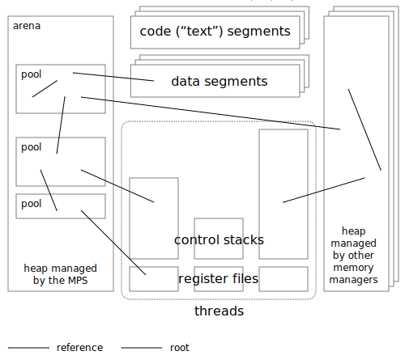

.. index::
   single: Memory Pool System; overview
   single: Ravenbrook Limited
   single: license; commercial terms

.. _guide-overview:

Overview of the Memory Pool System
==================================

The Memory Pool System is a very general, adaptable, flexible,
reliable, and efficient memory management system. It permits the
flexible combination of memory management techniques, supporting
:term:`manual <manual memory management>` and :term:`automatic memory
management`, :term:`inline allocation <inline allocation (1)>`,
:term:`finalization`, :term:`weakness <weak reference (1)>`, and
multiple concurrent co-operating :term:`incremental <incremental
garbage collection>` :term:`generational <generational garbage
collection>` :term:`garbage collections`. It also
includes a library of :term:`memory pool classes <pool class>`
implementing specialized memory management policies.

The MPS has been in development since 1994 and deployed in successful
commercial products since 1997. Bugs are almost unknown in production.
It is under continuous development and support by `Ravenbrook
<http://www.ravenbrook.com>`_.

The MPS is distributed under an :ref:`open source license
<license>`. The license is designed to make it possible for you to use
the MPS in your own projects, provided that you either don't
distribute your product, or your product is open source too.

If the licensing terms aren't suitable for you (for example, you're
developing a closed-source commercial product or a compiler run-time
system) you can easily license the MPS under different terms from
Ravenbrook by arrangement. Please :ref:`contact us <contact>` at
`mps-questions@ravenbrook.com <mailto:mps-questions@ravenbrook.com>`_
for details.

.. comment: Keep this section synchronized with readme.txt

.. index::
   single: Memory Pool System; supported target platforms
   single: platforms; supported

Supported target platforms
--------------------------

The MPS is currently supported for deployment on:

- Windows XP or later, on IA-32 and x86-64, using Microsoft Visual C/C++;

- Linux 2.6 or later, on IA-32 using GCC and on x86-64 using GCC or
  Clang/LLVM;

- FreeBSD 7 or later, on IA-32 and x86-64, using GCC or Clang/LLVM;

- macOS 10.4 or later, on IA-32 and x86-64, using Clang/LLVM.

The MPS is highly portable and has run on many other processors and
operating systems in the past (see :ref:`guide-build`). Most of the
MPS is written in very pure ANSI C and compiles without warnings on
anything.

.. warning::

    If you are running a multi-threaded 32-bit application on 64-bit
    Windows 7 via the WOW64 emulator, then you must install `this
    hotfix from Microsoft
    <http://support.microsoft.com/kb/2864432/en-us>`_. See `WOW64 bug:
    GetThreadContext() may return stale contents
    <http://zachsaw.blogspot.co.uk/2010/11/wow64-bug-getthreadcontext-may-return.html>`_
    for a description of the problem.

.. index::
   single: Memory Pool System; technical introduction

Technical introduction
----------------------

The figure below gives a simplified picture of a program's memory from
the point of view of the Memory Pool System.

    Overview of the Memory Pool System.

The **arena** is the top-level data structure in the MPS. An
:term:`arena` is responsible for requesting :term:`memory (3)` from
the operating system (and returning it), for making memory available
to :term:`pools`, and for :term:`garbage collection`. Multiple
arenas are supported, but it's usually best to have only one arena in
your program, because the MPS can't collect cyclic structures that
span multiple arenas. See :ref:`topic-arena`.

The MPS is designed to co-operate with other memory managers (for
example :term:`malloc` and :term:`free (2)` in :term:`C`, or operators
``new`` and ``delete`` in :term:`C++`), so you need not move all your
memory management to the MPS at once, and you can co-operate with
libraries that use other allocation mechanisms.

Within the arena you create one or more **pools**. A :term:`pool` is
responsible for requesting memory from the :term:`arena` and making it
available to your program. See :ref:`topic-pool`.

Pools belong to **pool classes** that specify policies for how their
memory is managed. Some pools are :term:`manually managed <manual
memory management>` (you must explicitly return memory to the pool,
for example by calling :c:func:`mps_free`) and others are
:term:`automatically managed <automatic memory management>` (the
:term:`garbage collector` reclaims :term:`unreachable` blocks). See
:ref:`pool`.

:term:`Formatted <formatted object>` pools need you to tell them how to
**scan** for :term:`references` to allocated blocks. See
:ref:`topic-scanning`.

The arena needs you to tell it how to find your **roots**: references
to allocated blocks that are stored in static data, in memory not
managed by the MPS, in your program's :term:`registers`, or on its
:term:`control stack`. See :ref:`topic-root`.

The MPS is designed to work with multi-threaded programs. Functions in
the C interface are thread safe, except in a few documented cases. See
:ref:`topic-thread`. The :term:`allocation point protocol` provides
fast lock-free allocation on multiple threads simultaneously. See
:ref:`topic-allocation`.

The garbage collector is :term:`incremental <incremental garbage
collection>`: it proceeds in small steps interleaved with the
execution of your program, so there are no long waits. The garbage
collector is designed to work efficiently with multiple pools, and
in cases where there are many references between objects in different
pools. See :ref:`topic-collection`.

What next?
----------

For a much more detailed technical overview of the MPS, see
:ref:`Brooksby (2002) <BROOKSBY02>`.

If you're going to try it out, see :ref:`guide-build`.

If you have a program in need of memory management, then you'll want
to learn how to integrate it with the Memory Pool System. See
:ref:`guide-lang`.

If you want to know more technical details, they appear in the
:ref:`reference`.
