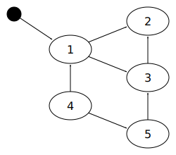

.. _mmref-recycle:

Recycling techniques
====================

There are many ways for automatic memory managers to determine what
memory is no longer required. In the main, garbage collection relies
on determining which blocks are not pointed to by any program
variables. Some of the techniques for doing this are described briefly
below, but there are many potential pitfalls, and many possible
refinements. These techniques can often be used in combination.

Tracing collectors
------------------

Automatic memory managers that follow pointers to determine which
blocks of memory are :term:`reachable` from program variables (known
as the :term:`root set`) are known as :dfn:`tracing` collectors. The
classic example is the mark-sweep collector.

Mark-sweep collection
^^^^^^^^^^^^^^^^^^^^^

In a :term:`mark-sweep` collection, the collector first examines the
program variables; any blocks of memory pointed to are added to a list
of blocks to be examined. For each block on that list, it sets a flag
(the mark) on the block to show that it is still required, and also
that it has been processed. It also adds to the list any blocks
pointed to by that block that have not yet been marked. In this way,
all blocks that can be reached by the program are marked.

In the second phase, the collector *sweeps* all allocated memory,
searching for blocks that have not been marked. If it finds any, it
returns them to the allocator for reuse.

    Five memory blocks, three of which are reachable from program variables.

In the diagram above, block 1 is directly accessible from a program
variable, and blocks 2 and 3 are indirectly accessible. Blocks 4 and 5
cannot be reached by the program. The first step would mark block 1,
and remember blocks 2 and 3 for later processing. The second step
would mark block 2. The third step would mark block 3, but wouldn't
remember block 2 as it is already marked. The sweep phase would ignore
blocks 1, 2, and 3 because they are marked, but would recycle blocks 4
and 5.

The two drawbacks of simple mark-sweep collection are:

* it must scan the entire memory in use before any memory can be freed;

* it must run to completion or, if interrupted, start again from scratch.

If a system requires real-time or interactive response, then simple
mark-sweep collection may be unsuitable as it stands, but many more
sophisticated garbage collection algorithms are derived from this
technique.

Copying collection
^^^^^^^^^^^^^^^^^^

After many memory blocks have been allocated and recycled, there are
two problems that typically occur:

* the memory in use is widely scattered in memory, causing poor
  performance in the :term:`memory caches <cache (1)>` or
  :term:`virtual memory` systems of most modern computers (known as
  poor :term:`locality of reference`);

* it becomes difficult to allocate large blocks because free memory is
  divided into small pieces, separated by blocks in use (known as
  :term:`external fragmentation`).

One technique that can solve both these problems is :term:`copying
garbage collection`. A copying garbage collector may move allocated
blocks around in memory and adjust any references to them to point to
the new location. This is a very powerful technique and can be
combined with many other types of garbage collection, such as
mark-sweep collection.

The disadvantages of copying collection are:

* it is difficult to combine with :term:`incremental garbage
  collection` (see below) because all references must be adjusted to
  remain consistent;

* it is difficult to combine with :term:`conservative garbage
  collection` (see below) because references cannot be confidently
  adjusted;

* extra storage is required while both new and old copies of an object
  exist;

* copying data takes extra time (proportional to the amount of
  :term:`live` data).

Incremental collection
^^^^^^^^^^^^^^^^^^^^^^

Older garbage collection algorithms relied on being able to start
collection and continue working until the collection was complete,
without interruption. This makes many interactive systems pause during
collection, and makes the presence of garbage collection obtrusive.

Fortunately, there are modern techniques (known as :term:`incremental
garbage collection`) to allow garbage collection to be performed in a
series of small steps while the program is never stopped for long. In
this context, the program that uses and modifies the blocks is
sometimes known as the :term:`mutator`. While the collector is trying
to determine which blocks of memory are reachable by the mutator, the
mutator is busily allocating new blocks, modifying old blocks, and
changing the set of blocks it is actually looking at.

Incremental collection is usually achieved with either the cooperation
of the memory hardware or the mutator; this ensures that, whenever
memory in crucial locations is accessed, a small amount of necessary
bookkeeping is performed to keep the collector's data structures
correct.

Conservative garbage collection
^^^^^^^^^^^^^^^^^^^^^^^^^^^^^^^

Although garbage collection was first invented in 1958, many languages
have been designed and implemented without the possibility of garbage
collection in mind. It is usually difficult to add normal garbage
collection to such a system, but there is a technique, known as
:term:`conservative garbage collection`, that can be used.

The usual problem with such a language is that it doesn't provide the
collector with information about the data types, and the collector
cannot therefore determine what is a pointer and what isn't. A
conservative collector assumes that anything *might* be a pointer. It
regards any data value that looks like a pointer to or into a block of
allocated memory as preventing the recycling of that block.

Note that, because the collector does not know for certain which
memory locations contain pointers, it cannot readily be combined with
copying garbage collection. Copying collection needs to know where
pointers are in order to update them when blocks are moved.

You might think that conservative garbage collection could easily
perform quite poorly, leaving a lot of garbage uncollected. In
practice, it does quite well, and there are refinements that improve
matters further.

Reference counts
----------------

A reference count is a count of how many :term:`references` (that is,
pointers) there are to a particular memory block from other blocks. It
is used as the basis for some automatic recycling techniques that do
not rely on tracing.
 

Simple reference counting
^^^^^^^^^^^^^^^^^^^^^^^^^

In a simple :term:`reference counting` system, a reference count is
kept for each :term:`object`. This count is incremented for each new
reference, and is decremented if a reference is overwritten, or if the
referring object is recycled. If a reference count falls to zero, then
the object is no longer required and can be recycled.

Reference counting is frequently chosen as an automatic memory
management strategy because it seems simple to implement using
:term:`manual memory management` primitives. However, it is hard to
implement efficiently because of the cost of updating the counts. It
is also hard to implement reliably, because the standard technique
cannot reclaim objects connected in a loop. In many cases, it is an
inappropriate solution, and it would be preferable to use
:term:`tracing garbage collection` instead.

Reference counting is most useful in situations where it can be
guaranteed that there will be no loops and where modifications to the
reference structure are comparatively infrequent. These circumstances
can occur in some types of database structure and some file systems.
Reference counting may also be useful if it is important that objects
are recycled promptly, such as in systems with tight memory
constraints.

Deferred reference counting
^^^^^^^^^^^^^^^^^^^^^^^^^^^

The performance of reference counting can be improved if not all
references are taken into account. In one important technique, known
as :term:`deferred reference counting`, only references from other
objects are counted, and references from program variables are
ignored. Since most of the references to the object are likely to be
from local variables, this can substantially reduce the overhead of
keeping the counts up to date. An object cannot be reclaimed as soon
as its count has dropped to zero, because there might still be a
reference to it from a program variable. Instead, the program
variables (including the :term:`control stack`) are periodically
:term:`scanned <scan>`, and any objects which are not referenced from
there and which have zero count are reclaimed.

Deferred reference counting cannot normally be used unless it is
directly supported by the compiler. It's more common for modern
compilers to support tracing garbage collectors instead, because they
can reclaim loops. Deferred reference counting may still be useful for
its promptness---but that is limited by the frequency of scanning the
program variables.

One-bit reference counting
^^^^^^^^^^^^^^^^^^^^^^^^^^

Another variation on reference counting, known as the :term:`one-bit
reference count`, uses a single bit flag to indicate whether each
object has either "one" or "many" references. If a reference to an
object with "one" reference is removed, then the object can be
recycled. If an object has "many" references, then removing references
does not change this, and that object will never be recycled. It is
possible to store the flag as part of the *pointer* to the object, so
no additional space is required in each object to store the count.
One-bit reference counting is effective in practice because most
actual objects have a reference count of one.

Weighted reference counting
^^^^^^^^^^^^^^^^^^^^^^^^^^^

Reference counting is often used for tracking inter-process references for :term:`distributed garbage collection`.  This fails to collect objects in separate processes if they have looped references, but tracing collectors are usually too inefficient as inter-process tracing entails much communication between processes.  Within a process, tracing collectors are often used for local recycling of memory.

Many distributed collectors use a technique called :term:`weighted
reference counting`, which reduces the level of communication even
further. Each time a reference is copied, the weight of the reference
is shared between the new and the old copies. Since this operation
doesn't change the total weight of all references, it doesn't require
any communication with the object. Communication is only required when
references are deleted.
