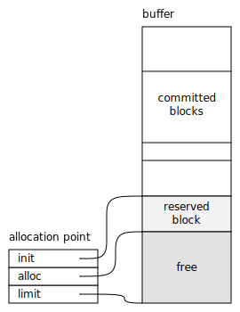
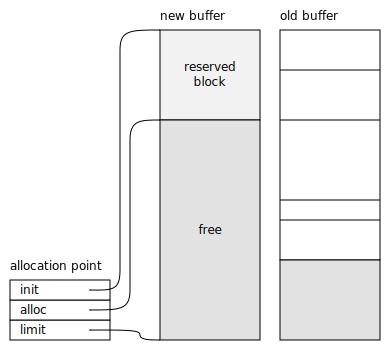

.. Sources:

    `<https://info.ravenbrook.com/project/mps/doc/2002-06-18/obsolete-mminfo/mmdoc/protocol/mps/alloc-point/>`_
    `<https://info.ravenbrook.com/project/mps/master/manual/wiki/apguide.html>`_
    `<https://info.ravenbrook.com/project/mps/master/design/buffer/>`_

.. index::
   single: allocation

.. _topic-allocation:

Allocation
==========

.. index::
   single: allocation; manual
   single: manual allocation

Manual allocation
-----------------

.. note::

    Not all :term:`pool classes` support this interface:
    :term:`automatically managed <automatic memory management>` pools
    typically support none of it, and even :term:`manually managed
    <manual memory management>` pools may not support the whole
    interface. Consult the pool class documentation for details. For
    example, the :ref:`pool-mvt` pool class supports deallocation via
    :c:func:`mps_free` but allocation must use allocation points, as
    described below.

.. c:function:: mps_res_t mps_alloc(mps_addr_t *p_o, mps_pool_t pool, size_t size)

    Allocate a :term:`block` of memory in a :term:`pool`.

    ``p_o`` points to a location that will hold the address of the
    allocated block.

    ``pool`` the pool to allocate in.

    ``size`` is the :term:`size` of the block to allocate. If it is
    unaligned, it will be rounded up to the pool's :term:`alignment`
    (unless the pool documentation says otherwise).

.. c:function:: void mps_free(mps_pool_t pool, mps_addr_t addr, size_t size)

    Free a :term:`block` of memory to a :term:`pool`.

    ``pool`` is the pool the block belongs to.

    ``addr`` is the address of the block to be freed.

    ``size`` is the :term:`size` of the block to be freed. If it is
    unaligned, it will be rounded up to the pool's :term:`alignment`
    (unless the pool documentation says otherwise).

    The freed block of memory becomes available for allocation by the
    pool, or the pool might decide to make it available to other
    pools, or it may be returned to the operating system.

    .. note::

        :c:func:`mps_free` takes a ``size`` parameter because it is
        most efficient to do so. In most programs, the type of an
        object is known at the point in the code that frees it, hence
        the size is trivially available. In such programs, storing the
        size on the MPS side would cost time and memory, and make it
        hard to get good virtual memory behaviour because of the need
        to touch the object in order to free it. As it is, the
        deallocation code doesn't have to touch the dead object at
        all.

.. index::
   single: allocation point

Allocation points
-----------------

:term:`Allocation points` provide fast, :term:`inline <inline
allocation (1)>`, nearly :term:`lock-free <lock free>` allocation.
They allow code to allocate without calling an allocation function:
this is vital for performance in languages or programs that allocate
many small objects. They must be used according to the
:ref:`topic-allocation-point-protocol`.

.. c:type:: mps_ap_t

    The type of :term:`allocation points`. It is a
    :term:`transparent alias <transparent type>` for a pointer to
    :c:type:`mps_ap_s`.

.. c:function:: mps_res_t mps_ap_create_k(mps_ap_t *ap_o, mps_pool_t pool, mps_arg_s args[])

    Create an :term:`allocation point` in a :term:`pool`.

    ``ap_o`` points to a location that will hold the address of the
    allocation point, if successful.

    ``pool`` is the pool.

    ``args`` are :term:`keyword arguments` specific to the pool class
    to which ``pool`` belong. See the documentation for that pool
    class. (Most pool classes don't take any keyword arguments; in
    those cases you can pass :c:macro:`mps_args_none`.)

    Returns :c:macro:`MPS_RES_OK` if successful, or another
    :term:`result code` if not.

    .. warning::

        An allocation point must not be used by more than one
        :term:`thread`: each thread must create its own allocation
        point or points.

    .. note::

        There's an alternative function :c:func:`mps_ap_create_v` that
        takes its extra arguments using the standard :term:`C`
        ``va_list`` mechanism.

.. c:function:: mps_res_t mps_ap_create(mps_ap_t *ap_o, mps_pool_t pool, ...)

    .. deprecated:: starting with version 1.112.

        Use :c:func:`mps_ap_create_k` instead: the :term:`keyword
        arguments` interface is more reliable and produces better
        error messages.

    An alternative to :c:func:`mps_ap_create_k` that takes its extra
    arguments using the standard :term:`C` variable argument list
    mechanism.

.. c:function:: mps_res_t mps_ap_create_v(mps_ap_t *ap_o, mps_pool_t pool, va_list args)

    .. deprecated:: starting with version 1.112.

        Use :c:func:`mps_ap_create_k` instead: the :term:`keyword
        arguments` interface is more reliable and produces better
        error messages.

    An alternative to :c:func:`mps_ap_create_k` that takes its extra
    arguments using the standard :term:`C` ``va_list`` mechanism.

.. c:function:: void mps_ap_destroy(mps_ap_t ap)

    Destroy an :term:`allocation point`.

    ``ap`` is the allocation point to destroy.

    Destroying an allocation point has no effect on blocks that were
    allocated from it, so long as they were successfully
    :term:`committed (2)` by :c:func:`mps_commit`.

.. index::
   single: allocation point protocol

.. _topic-allocation-point-protocol:

Allocation point protocol
-------------------------

This protocol is designed to work with :term:`incremental garbage
collection` and multiple :term:`threads`, where between any
two instructions in the :term:`client program`, the MPS may run part
of a :term:`garbage collection`, :term:`move <moving memory manager>`
blocks in memory, rewrite pointers, and reclaim space. In order to
reliably handle this, the allocation point protocol consists of (at
least) two steps, a *reserve* followed by a *commit*.

.. note::

    The description of the protocol assumes that you have declared
    your threads' :term:`control stacks` and :term:`registers` to be
    :term:`ambiguous roots`, by passing :c:func:`mps_stack_scan_ambig`
    to :c:func:`mps_root_create_reg`. This is the simplest way to
    write a client, but other scenarios are possible. Please
    :ref:`contact us <contact>` if your use case is not covered here
    (for example, if you need an exact collector).

When the client program is initializing a newly allocated object, you
can think of it as being "in a race" with the MPS. Until the object is
initialized, the MPS cannot manage it in the usual way: in particular,
it cannot ensure that the new object remains correct if other objects
move during its initialization. So if other objects *do* move, the MPS
tells the client program that it has "lost the race": the
partially-initialized object may be invalid, and the client must
initialize it again from scratch.

The allocation point protocol is as follows:

#. Call :c:func:`mps_reserve` to reserve a block of memory on an
   allocation point. The size of the block must be a multiple of the
   :term:`alignment` of the pool in which the allocation point was
   created.

   If :c:func:`mps_reserve` returns :c:macro:`MPS_RES_OK`, go to step 2.

   Otherwise, the block cannot be reserved (this might happen if the
   MPS is out of memory).

#. Initialize the block. During this step the block must not be
   referenced by an :term:`exact reference`, and references stored in
   it must not be followed.

   The block need not be initialized completely, but if the pool has
   an :term:`object format`, then by the end of this step, the block
   must be capable of being passed to the format's :term:`scan method`
   and :term:`skip method`.

#. Call :c:func:`mps_commit` to attempt to commit the object to the
   care of the MPS.

   If :c:func:`mps_commit` returns true, this means that the object is
   valid, and is now under the management of the MPS. The client program
   may rely on references stored in the object, and may store references
   to the new object in its other objects.

   If :c:func:`mps_commit` returns false, this means that the block is
   invalid. It is usual in this case to go back to step 1 and re-reserve
   and re-initialize it, but other courses of action are permitted.

   .. note::

       In this case, the reason the block is invalid because a
       :term:`flip` took place after the call to
       :c:func:`mps_reserve` and before the call to
       :c:func:`mps_commit`. This means that references in the block
       may point to the old location of blocks that moved.

The usual implementation of the allocation point protocol in :term:`C`
is thus::

    mps_addr_t p;
    obj_t obj;
    size_t aligned_size = ALIGN(size); /* see note 1 */
    do {
        mps_res_t res = mps_reserve(&p, ap, aligned_size);
        if (res != MPS_RES_OK) /* handle the error */;
        /* p is now an ambiguous reference to the reserved block */
        obj = p;
        /* initialize obj */
    } while (!mps_commit(ap, p, aligned_size)); /* see note 2 */
    /* obj is now valid and managed by the MPS */

.. note::

    1. Here :c:func:`ALIGN` represents a function or macro that
       rounds ``size`` up to the necessary alignment, which should be
       at least as big as the alignment of the pool. (The reason that
       the MPS does not do this rounding up for you is to provide more
       opportunities for optimization: in many cases the required
       alignment will be a constant that's known at compilation time.)

    2. :c:func:`mps_commit` returns false only if a garbage collection
       :term:`flip` occurs after :c:func:`mps_reserve`.  This is a very
       rare event, especially if the object initialization is short.

.. c:function:: mps_res_t mps_reserve(mps_addr_t *p_o, mps_ap_t ap, size_t size)

    Reserve a :term:`block` of memory on an :term:`allocation point`.

    ``p_o`` points to a location that will hold the address of the
    reserved block.

    ``ap`` is the allocation point.

    ``size`` is the :term:`size` of the block to allocate. It must be
    a multiple of the :term:`alignment` of the pool (or of the pool's
    :term:`object format` if it has one).

    Returns :c:macro:`MPS_RES_OK` if the block was reserved
    successfully, or another :term:`result code` if not.

    The reserved block may be initialized but must not otherwise be
    used 

    Until it has been :term:`committed (2)` via a successful call to
    :c:func:`mps_commit`, the reserved block may be:

    * initialized;
    * referenced by an :term:`ambiguous reference`;

    but:

    * it must not be referenced by an :term:`exact reference`;
    * references stored in it must not be followed;
    * it is not scanned, moved, or protected (even if it belongs to a
      pool with these features).

    .. note::

        :c:func:`mps_reserve` must only be called according to the
        :ref:`topic-allocation-point-protocol`.

        :c:func:`mps_reserve` is implemented as a macro for speed. It
        may evaluate its arguments multiple times.

        There is an alternative, :c:func:`MPS_RESERVE_BLOCK`, which
        may generate faster code on some compilers.

.. c:function:: MPS_RESERVE_BLOCK(mps_res_t res_v, mps_addr_t *p_v, mps_ap_t ap, size_t size)

    An alternative to :c:func:`mps_reserve`. On compilers that do not
    perform common-subexpression elimination, it may generate faster
    code than :c:func:`mps_reserve` (but may not). It may only be used
    in statement context (not as an expression).

    The second argument is an lvalue ``p_v``, which is assigned the
    address of the reserved block. It takes an additional first
    argument, the lvalue ``res_v``, which is assigned the
    :term:`result code`.

.. c:function:: mps_bool_t mps_commit(mps_ap_t ap, mps_addr_t p, size_t size)

    :term:`Commit <committed (2)>` a reserved :term:`block` on an
    :term:`allocation point`.

    ``ap`` is an allocation point.

    ``p`` points to a block that was reserved by :c:func:`mps_reserve`
    but has not yet been committed.

    ``size`` is the :term:`size` of the block to allocate. It must be
    the same size that was passed to :c:func:`mps_reserve`.

    If :c:func:`mps_commit` returns true, the block was successfully
    committed, which means that the :term:`client program` may use it,
    create references to it, and rely on references from it. It also
    means that the MPS may scan it, move it, protect it, or reclaim it
    (if ``ap`` was attached to a pool with those features).

    If :c:func:`mps_commit` returns false, the block was not
    committed. This means that the client program must not create
    references to the block, rely on references from it, or otherwise
    use it. It is normal to attempt the reserve operation again when
    this happens.

    It is very rare for :c:func:`mps_commit` to return false: this
    only happens if there was a :term:`flip` between the call to
    :c:func:`mps_reserve` and the call to
    :c:func:`mps_commit`. Nonetheless, it can happen, so it is
    important not to perform operations with side effects (that you
    aren't prepared to repeat) between calling :c:func:`mps_reserve`
    and :c:func:`mps_commit`. Also, the shorter the interval, the less
    likely :c:func:`mps_commit` is to return false.

    .. note::

        :c:func:`mps_commit` must only be called according to the
        :ref:`topic-allocation-point-protocol`.

        :c:func:`mps_commit` is implemented as a macro for speed. It
        may evaluate its arguments multiple times.

.. index::
   single: allocation point protocol; example

Example: allocating a symbol
----------------------------

::

    typedef struct symbol_s {
        type_t type;                  /* TYPE_SYMBOL */
        size_t length;                /* length of symbol string (excl. NUL) */
        char string[1];               /* symbol string, NUL terminated */
    } symbol_s, *symbol_t;

    symbol_t make_symbol(size_t length, char string[])
    {
        symbol_t symbol;
        mps_addr_t addr;
        size_t size = ALIGN(offsetof(symbol_s, string) + length+1);
        do {
            mps_res_t res = mps_reserve(&addr, ap, size);
            if (res != MPS_RES_OK) error("out of memory in make_symbol");
            symbol = addr;
            symbol->type = TYPE_SYMBOL;
            symbol->length = length;
            memcpy(symbol->string, string, length+1);
        } while (!mps_commit(ap, addr, size));
        return symbol;
    }

.. index::
   pair: allocation point protocol; cautions

.. _topic-allocation-cautions:

Cautions
--------

While a block is reserved but not yet committed:

#.  The client program must not create an :term:`exact reference` to
    the reserved block (for example, by referring to the reserved block
    from a :term:`formatted object`). All references to it must be
    ambiguous (for example, local variables).

#.  Similar restrictions apply to a reference that has been stored in
    the reserved block. Such a reference might be invalid, and must
    not be copied to an :term:`exact reference` or dereferenced. It is
    safe to copy such a reference if it remains ambiguous (for
    example, copying to a local variable or to another part of the new
    block).

Before calling :c:func:`mps_commit`:

#.  The new block must be validly formatted. If it belongs to an
    :term:`object format`, then it must be correctly recognized by the
    format methods (the :term:`skip method` must return the object's
    correct size; the :term:`scan method` must scan it; the
    :term:`is-forwarded method` must report that it is not a
    forwarding object, and so on).

#.  All exact references in the new block (references that are
    :term:`fixed` by scanning functions) must contain valid
    references or null pointers.

#.  The new object must be ambiguously :term:`reachable`.

You do not have to initialize the whole block so long as you satisfy
these conditions. For example, it is permissible to defer
initialization completely (for example, by writing
``TYPE_UNINITIALIZED`` into a tag field), so long as you handle this
correctly in the format methods.

However, if you do not initialize the whole block then you should
beware: the uninitialized contents of the block is likely to consist
of dead objects. If, due to a bug, you created an exact reference into
the middle of the uninitialized block, this might by bad luck point to
a dead object, which would be resurrected (and it might well contain
further exact references to other dead objects). To ensure detection
of such a bug promptly you should consider filling the uninitialized
object with dummy values that cannot be mistaken for part of a valid
formatted object (at least in the debugging version of your program).

.. note::

    Some :term:`pool classes` have debugging counterparts that
    automatically overwrite free space with a pattern of bytes of your
    choosing. See :ref:`topic-debugging`.

.. index::
   single: allocation point protocol; bugs
   single: bug; allocation point protocol

Example: inserting into a doubly linked list
--------------------------------------------

This example contains several mistakes. See the highlighted lines:

.. code-block:: c
    :emphasize-lines: 21, 22, 23, 25

    typedef struct link_s {
        type_t type;                       /* TYPE_LINK */
        /* all three of these pointers are fixed: */
        struct link_s *prev;
        struct link_s *next;
        obj_t obj;
    } link_s, *link_t;

    /* insert 'obj' into the doubly-linked list after 'head' */
    link_t insert_link(link_t head, obj_t obj)
    {
        mps_addr_t p;
        link_t link;
        size_t size = ALIGN(sizeof(link_s));
        do {
            mps_res_t res = mps_reserve(&p, ap, size);
            if (res != MPS_RES_OK) error("out of memory");
            link = p;
            link->type = TYPE_LINK;
            link->prev = head;
            link->next = link->prev->next; /* (1) */
            head->next = link;             /* (2) */
            link->next->prev = link;       /* (3) */
        } while (!mps_commit(ap, p, size));
        link->obj = obj;                   /* (4) */
        return link;
    }

The mistakes are:

#. Dereferencing a reference (here, ``link->prev``) that was stored in
   the reserved block.

#. Making an exact reference to the reserved block (here,
   ``head->next`` becomes an exact reference to ``link``). This must
   be deferred until after a successful commit.

#. This line makes both mistakes made by lines (1) and (2).

#. The ``obj`` slot contains an exact reference that gets fixed by the
   scan method, so it must be initialized before the call to commit.

A correct version of ``insert_link`` looks like this::

    link_t insert_link(link_t head, obj_t obj)
    {
        mps_addr_t p;
        link_t link;
        size_t size = ALIGN(sizeof(link_s));
        do {
            mps_res_t res = mps_reserve(&p, ap, size);
            if (res != MPS_RES_OK) error("out of memory");
            link = p;
            link->type = TYPE_LINK;
            link->prev = head;
            link->next = head->next;
            link->obj = obj;
        } while (!mps_commit(ap, p, size));
        head->next->prev = link;
        head->next = link;
        return link;
    }

.. index::
   single: allocation points; implementation

.. _topic-allocation-point-implementation:

Allocation point implementation
-------------------------------

An allocation point consists of a structure of type :c:type:`mps_ap_s`
and an associated :term:`buffer`.

    Allocation point and its associated buffer.

The buffer is structured as shown in the figure, with free space at
the end of the buffer, *committed* blocks at the beginning, and
(possibly) one *reserved* block in the middle. The :c:type:`mps_ap_s`
structure contains three addresses into the associated buffer:
``limit`` points to the end of the buffer, ``alloc`` points to the
beginning of the free space, and ``init`` points to the end of the
initialized blocks.

Allocation points are fast and nearly lock-free because in order to
reserve space for a new block, the client program first checks that
``ap->alloc + size <= ap->limit`` and in the common case that it is,
it takes a copy of ``ap->init`` (which now points to the reserved
block) and sets ``ap->alloc += size``.

What happens when ``ap->alloc + size > ap->limit``, that is, when the
new block won't fit in the buffer? Then the buffer needs to be
*refilled* by calling :c:func:`mps_ap_fill`, with typical results
shown in the diagram below.

    Allocation point after refilling.

Refilling is why allocation points are only *nearly* lock-free:
:c:func:`mps_ap_fill` has to take locks on internal MPS data
structures.

Note that :c:func:`mps_ap_fill` reserves the requested block as well
as refilling the buffer.

The *reserve* operation thus looks like this::

    if (ap->alloc + size <= ap->limit) {
        ap->alloc += size;
        p = ap->init;
    } else {
        res = mps_ap_fill(&p, ap, size);
        if (res != MPS_RES_OK) {
            /* handle error */;
        }
    }

The critical path consists of an add, a store, and a branch (and
branch prediction should work well since the test usually succeeds).

.. note::

    Normally the client program would use the macro
    :c:func:`mps_reserve` to perform this operation, as described
    above, rather than directly accessing the fields of the allocation
    point structure. But there are use cases where direct access is
    needed to generate the fastest code (for example, in the case of a
    compiler generating machine code that needs to interface with the
    MPS), and it is for these use cases that the details of
    :c:type:`mps_ap_s` are made public and supported.

When the new block has been initialized it must be :term:`committed
(2)`. To do this, set ``ap->init = ap->alloc`` and then check to see
if the allocation point has been *trapped*: that is, if the garbage
collector might have moved some objects since the new block was
reserved. The garbage collector traps an allocation point by setting
``ap->limit = 0``, so if this case is found, then the reserved block
may have been invalidated, and must be discarded and re-reserved, and
the buffer must be refilled. The function :c:func:`mps_ap_trip`
determines whether or not this case applies, returning true if the
block is valid, false if not.

The *commit* operation thus looks like this::

    ap->init = ap->alloc;
    if (ap->limit == 0 && !mps_ap_trip(ap, p, size)) {
        /* p is invalid */
    } else {
        /* p is valid */
    }

The critical path here consists of a store and a branch (and again,
branch prediction should work well since the test almost never fails).

.. note::

    Normally the client program would use :c:func:`mps_commit` to
    perform this operation, as described above, rather than directly
    accessing the fields of the allocation point structure. But direct
    access is supported by the MPS.

.. note::

    The commit operation relies on atomic ordered access to words in
    memory to detect a :term:`flip` that occurs between the assignment
    ``ap->init = ap->alloc`` and the test ``ap->limit == 0``. A
    compiler or processor that reordered these two instructions would
    break the protocol. On some processor architectures and some
    compilers, it may be necessary to insert a memory barrier
    instruction at this point.

.. c:type:: mps_ap_s

    The type of the structure used to represent :term:`allocation
    points`::

         typedef struct mps_ap_s {
             mps_addr_t init;
             mps_addr_t alloc;
             mps_addr_t limit;
             /* ... private fields ... */
         } mps_ap_s;

    ``init`` is the limit of initialized memory.

    ``alloc`` is the limit of allocated memory.

    ``limit`` is the limit of available memory.

    An allocation point is an interface to a :term:`pool` which
    provides very fast allocation, and defers the need for
    synchronization in a multi-threaded environment.

    Create an allocation point for a pool by calling
    :c:func:`mps_ap_create_k`, and allocate memory via one by calling
    :c:func:`mps_reserve` and :c:func:`mps_commit`.

.. c:function:: mps_res_t mps_ap_fill(mps_addr_t *p_o, mps_ap_t ap, size_t size)

    Reserve a :term:`block` of memory on an :term:`allocation point`
    when the allocation point has insufficient space.

    :c:func:`mps_ap_fill` has same interface as :c:func:`mps_reserve`.

    .. note::

        :c:func:`mps_ap_fill` must only be called according to the
        :ref:`topic-allocation-point-protocol`.

.. c:function:: mps_bool_t mps_ap_trip(mps_ap_t ap, mps_addr_t p, size_t size)

    Test whether a reserved block was successfully :term:`committed
    (2)` when an :term:`allocation point` was trapped.

    :c:func:`mps_ap_trip` has the same interface as :c:func:`mps_commit`.

    .. note::

        :c:func:`mps_ap_trip` must only be called according to the
        :ref:`topic-allocation-point-protocol`.
